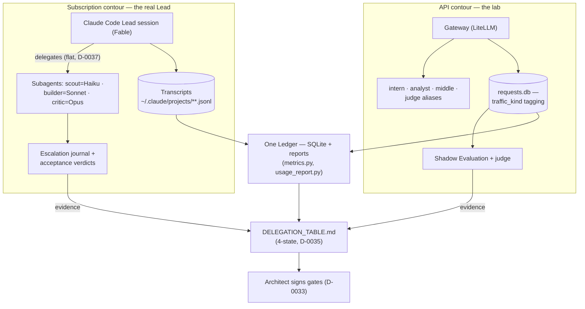
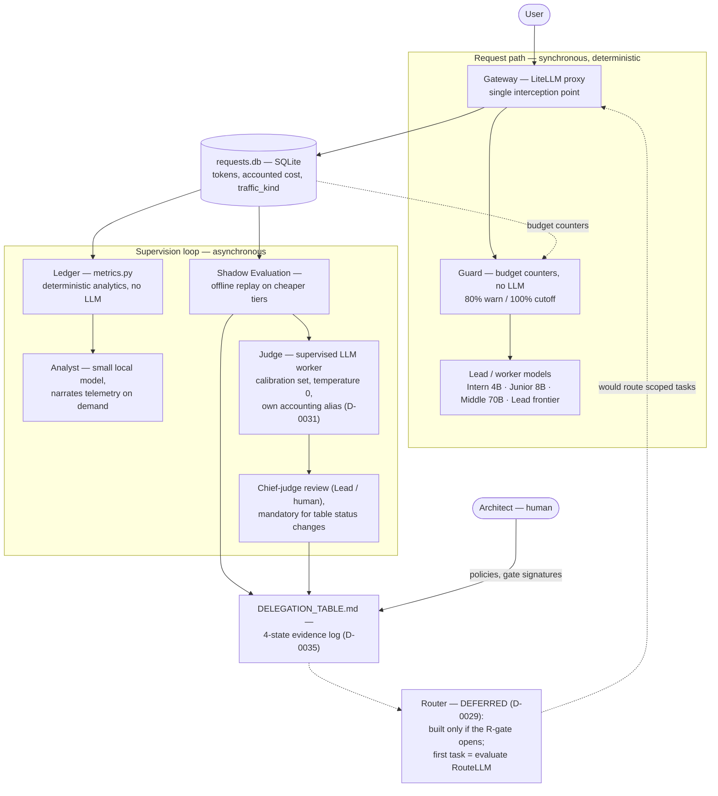

# Architecture

This document is the authoritative architecture specification.
It supersedes the draft document "LLM Hierarchical Architecture v2".

## Problem

The strongest available model (the Lead) consumes tokens faster than any
smaller model, does not notice when limits approach, and spends a large
share of its budget on work that does not require frontier intelligence
(re-explaining context, formatting, extraction, repetition).

The goal is a system where the Lead works on hard problems while cheaper
components enforce budgets, explain spending, and take over delegable work.

## Core Insight

"A junior model watching the senior model" decomposes into three
mechanisms with different reliability requirements:

1. **Enforcing limits** requires 100% reliability and zero latency.
   This is deterministic software, never an LLM.
2. **Explaining where tokens go** is analytics over a request log.
   The math is deterministic; an LLM is only needed to narrate results.
3. **Recommending delegation** is the only genuine LLM task, and even it
   must be validated against real data (see Shadow Evaluation).

**Rule #1: the cost of supervision must be measurably lower than the
savings it produces. A component that violates this rule is removed.**

## Two Contours (D-0034)

The operator's real Lead is a Claude Code subscription; it cannot be
routed through a proxy. The system therefore runs on two substrates
with one discipline:

Rule #1, accounting prices (D-0032), evidence-gated statuses and
judge supervision are identical on both contours; only the
measurement mechanism differs. On the API contour delegation is
validated by replay (Shadow Evaluation + judge); on the subscription
contour replay is impossible, so acceptance verdicts and the
escalation journal are the evidence stream. Subscription usage is
accounted at API list prices (a subscription is a cash discount, not
a cost of zero). Plan of record for the merged workstream:
docs/UNIFIED_PLAN_2026-07-07.md.

**Delegation is flat on both contours (D-0037): workers never spawn
workers.** Decomposition, spec writing and acceptance stay with the
coordinator; parallelism means the coordinator dispatches several
workers with independent specs. A worker that finds its task
decomposable escalates ("decomposable" is an escalation-journal
category). Dispatch of an already-scoped task is cheap (static rules;
the future Router); decomposition defaults to the strongest available
tier and moves down only via delegation-table evidence.

## Components (API contour)

The full scheme, including the evidence loop (judge) and the deferred
Router. Solid edges are operational today; dashed edges are gated
future behavior.

### Gateway

All model traffic passes through a single proxy (LiteLLM).
This is the interception point that makes everything else possible.

### Guard

Deterministic budget enforcement inside the request path:
counters per model and per day, warning at 80% of budget,
hard refusal at 100%. No LLM involved.

### Ledger

Asynchronous analytics over the request log. Key metrics:

- tokens and cost per request, per task category, per model;
- **context-repetition ratio** — overlap between consecutive prompts.
  Repeated context is the primary suspected cost driver;
- share of requests that were simple enough for a cheaper model
  (retroactively, via Shadow Evaluation);
- latency and answer length trends.

### Analyst

A small local model (Ollama, Qwen3-4B class) that reads Ledger output —
never raw conversations. It runs in parallel with the Lead in the sense
that the user can query it at any moment without interrupting the Lead.
It answers questions ("why so expensive?"), produces a daily digest,
and maintains the Delegation Table.

### Lead and Workers

The model hierarchy:

| Level | Role | Example |
|---|---|---|
| Intern | formatting, extraction, JSON | 4B local |
| Junior | classification, summarization, routing (future) | 8B local |
| Middle | routine coding | coding model |
| Senior (Lead) | architecture, planning, research | frontier API model |
| Architect | defines policies | human |

On the subscription contour the same tiers materialize as Claude Code
subagents: scout=Haiku (context gathering), builder=Sonnet
(implementation to a written spec), critic=Opus (review, hard
debugging); the Lead session coordinates and never delegates
decomposition or acceptance (D-0037).

## Shadow Evaluation

Delegation recommendations are validated, not assumed:
a sample of real Lead requests is replayed offline on a cheaper model
and the outputs are compared (heuristics or an LLM judge).
The result feeds DELEGATION_TABLE.md, converting estimates into data.

The initial Delegation Table is an estimate produced up front
(see D-0028); Shadow Evaluation refines it continuously during
implementation rather than blocking implementation on a long
measurement phase.

## Deliberately Deferred

- **Router** — built only after telemetry shows what is worth routing (D-0029).
- LangGraph, Redis, PostgreSQL, vLLM, Langfuse — added only when the
  MVP stack measurably fails to cope.
- Multi-agent orchestration of any other kind.

## MVP Stack

- Gateway: LiteLLM proxy
- Log: SQLite
- Metrics: pure Python
- Analyst: Ollama + Qwen3-4B class model
- Lead: frontier model via API

## Plan

The phase and gate structure lives in ROADMAP.md (single owner; this
document no longer duplicates it). Plan of record for the Claude Code
workstream: docs/UNIFIED_PLAN_2026-07-07.md.

## Related Documents

- DELEGATION_TABLE.md — living cost/value table for delegation decisions.
- WHITE_PAPER.md — the project's primary written deliverable.
- docs/UNIFIED_PLAN_2026-07-07.md — plan of record (D-0034..D-0036).
- docs/RELATED_WORK.md — external projects and cost data this design is checked against.
- PROJECT_CHARTER.md, PROJECT_PHILOSOPHY.md, ANTI_GOALS.md, SYSTEM_PROMPT.md — constitution.
- DECISIONS.md — decision log.
