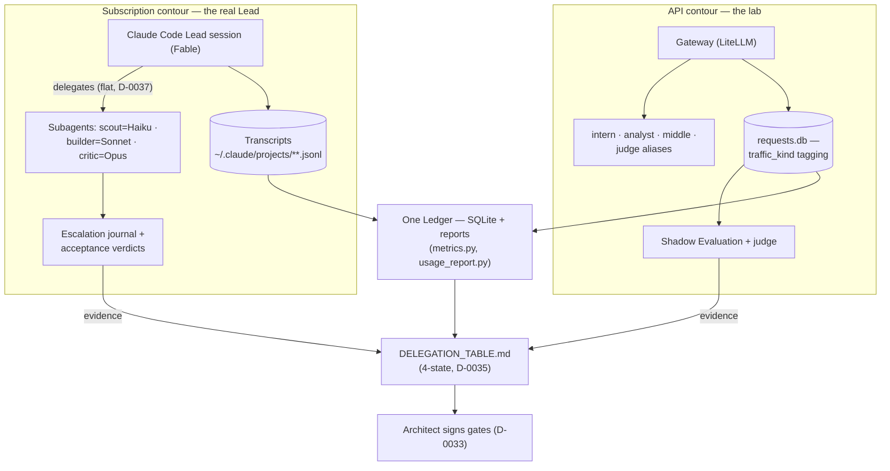

# Architecture

This document is the authoritative architecture specification.
It supersedes the draft document "LLM Hierarchical Architecture v2".

Boot note (D-0067): sessions load the condensed core
ARCHITECTURE_BOOT.md; this full specification is point-read on
demand. Editing a section here — check whether the boot core must
follow (SIBLING_MAP axis 4 pair).

## Problem

The strongest available model (the Lead) consumes tokens faster than any
smaller model, does not notice when limits approach, and spends a large
share of its budget on work that does not require frontier intelligence
(re-explaining context, formatting, extraction, repetition).

The goal is a system where the Lead works on hard problems while cheaper
components enforce budgets, explain spending, and take over delegable work.

## Core Insight

"A junior model watching the senior model" decomposes into three
mechanisms with different reliability requirements:

1. **Enforcing limits** requires 100% reliability and zero latency.
   This is deterministic software, never an LLM.
2. **Explaining where tokens go** is analytics over a request log.
   The math is deterministic; an LLM is only needed to narrate results.
3. **Recommending delegation** is the only genuine LLM task, and even it
   must be validated against real data (see Shadow Evaluation).

**Rule #1: the cost of supervision must be measurably lower than the
savings it produces. A component that violates this rule is removed.**

**Two-layer enforcement (D-0063): code guarantees the encounter,
AI judges the meaning.** Policy text can go unread or be forgotten
under context pressure; a gate on the execution path (git hook,
journal validator, budget wall) cannot be skipped — so the rule is
guaranteed to be MET. But code decides only what is deterministically
decidable: presence, shape, typed fields, counts. The verdict on
whether the rule was fulfilled in meaning (does the witness prove
the DoD? is the trail faithful?) belongs to an AI tier above the
performer — acceptance, critic, calibration — and is never inferred
from syntactic proxies: a gate that judges semantics by signs
manufactures false confidence (the F-14 class as a system defect).
The inverse also holds: a deterministically decidable sub-question
must not live on AI attention — it drifts and it costs (Rule #1).
Discipline-held mechanisms are promoted to gates on journal evidence
of leaks, never for symmetry. This refines mechanisms 1–3 above:
enforcement is code, judgment is tiered AI, and weekly calibration
audits both layers.

## Two Contours (D-0034)

The operator's real Lead is a Claude Code subscription; it cannot be
routed through a proxy. The system therefore runs on two substrates
with one discipline:

Rule #1, accounting prices (D-0032), evidence-gated statuses and
judge supervision are identical on both contours; only the
measurement mechanism differs. On the API contour delegation is
validated by replay (Shadow Evaluation + judge); on the subscription
contour replay is impossible, so acceptance verdicts and the
escalation journal are the evidence stream. Subscription usage is
accounted at API list prices (a subscription is a cash discount, not
a cost of zero). Plan of record for the merged workstream:
docs/UNIFIED_PLAN_2026-07-07.md.

**Delegation is flat on both contours (D-0037): workers never spawn
workers.** Decomposition, spec writing and acceptance stay with the
coordinator; parallelism means the coordinator dispatches several
workers with independent specs. A worker that finds its task
decomposable escalates ("decomposable" is an escalation-journal
category). Dispatch of an already-scoped task is cheap (static rules;
the future Router); decomposition defaults to the strongest available
tier and moves down only via delegation-table evidence.

**Workers run in the background by default (D-0040).** A coordinator
blocked waiting on a worker wastes Lead availability — the scarcest
subscription-contour resource: while a long worker runs, the Lead
plans, reviews other results, talks to the operator, or dispatches
parallel workers. Blocking waits are reserved for strictly sequential
steps where the next action depends on the result and nothing else is
pending. Acceptance on completion stays mandatory (D-0037).

## Portability (the policy is the router)

Nothing in the running system is a routing component: routing
decisions are made by the Lead session itself, reading an auto-loaded
policy (CLAUDE.md). Claude Code supplies only the dispatch mechanism
(subagents with a model bound per tier); the deferred Router (D-0029)
would replace the Lead's judgment for already-scoped dispatch only if
its gate ever opens. Porting the system to a different model family
or harness therefore means porting a POLICY, not software.

Substrate-independent by design (D-0005):

- tiers are defined by FUNCTION (recon / implementation-to-spec /
  review / decomposition-and-acceptance), not by vendor models;
- the routing rules themselves: delegation down by default,
  escalation after two rejections, flat delegation (D-0037), a DoD in
  every dispatch (D-0054), trail/witness acceptance (D-0046/D-0052),
  and the journal event vocabulary (D-0053);
- DELEGATION_TABLE.md with its four evidence statuses (D-0035) and
  the weekly calibration loop (D-0047).

The API contour already runs non-Claude models under this exact
discipline (Qwen3-4B as intern, Llama-3.3-70B as middle, Gemini as a
lead alias) — the discipline was never Claude-specific.

A new deployment must supply four things:

1. a tier→model binding (this repo: agent frontmatter plus the tier
   list in CLAUDE.md; API contour: gateway aliases in config.yaml);
2. a dispatch mechanism the coordinator can physically call
   (subagents, tool calls into other models, gateway aliases);
3. the policy AUTO-LOADED into the coordinator's context — delegation
   is opt-in and silently dies without this (D-0041, finding F-1);
4. a telemetry source for calibration (transcripts or a request log).

Evidence does NOT port with the policy: table statuses bind a task
type to a CONCRETE model, not to a tier label (classification→intern
is `rejected` for Qwen3-4B, not for every small model). A new model
set starts at `estimated` (D-0028, D-0035) and earns its statuses
through its own acceptance stream or Shadow Evaluation — the policy
tells a new deployment HOW to decide and how to accumulate evidence,
not where its tier boundaries lie.

### Deployment targets (operator direction, 2026-07-09)

The system is built to be adopted by OTHER projects. Three target
shapes, in order of validation status:

1. **A Claude Code subscription project** — being validated in
   production NOW: AO3 is the pilot, this repository the reference
   (dogfooding) deployment. The harness supplies dispatch
   (subagents) and telemetry (transcripts); the project supplies
   CLAUDE.md and role files.
2. **A project holding API keys to one or more model vendors** —
   the gateway variant: bindings = gateway aliases, dispatch = calls
   through the gateway, telemetry = requests.db. NOT yet validated
   as an agentic deployment: today's gateway instance serves the lab
   role (prompt→text validation of quality and prices) and lacks an
   API-side coordinator, a tool harness for workers (recon is blind
   without read/grep) and a journal writer. Cheap entry steps exist:
   survey of agent harnesses over an OpenAI-compatible API (D-0030)
   and the local-scout evaluation (queued 2026-07-09, D-0057 golden
   set as the entrance exam). This is the future second pilot — the
   API-world analog of AO3.
3. **A different vendor's subscription harness** (a GPT-class
   assistant, etc.) — the policy ports verbatim because it speaks
   function names (D-0062); that harness must supply the four
   requirements above, notably auto-loading the policy (F-1: without
   it delegation silently dies). Not validated; no pilot planned
   until (2) lands.

"Lab" is the CURRENT ROLE of this repo's gateway instance, not the
ceiling of the API substrate: in shape (2) the same gateway carries
a full agentic deployment, and every function — including recon —
gets a binding.

## Two Vocabularies: Functions and Grades (D-0062)

The two contours name their tiers differently, and the difference is
load-bearing. The POLICY speaks only the FUNCTION vocabulary; the
GRADE vocabulary belongs to models and accounting.

| Function (canonical policy name) | Duty | Subscription binding (this repo) | API-contour service today |
|---|---|---|---|
| **scout** — recon | search/read, digest with a trail (D-0046) | Haiku subagent | — (no repository access on this contour; recorded difference) |
| **builder** — implementation to a written spec | code/tests, witness (D-0052) | Sonnet subagent | `middle` alias for routine-coding task categories |
| **critic** — review | verdict with a trail | Opus subagent | judge + chief-judge (D-0031) — empirically Senior-tier work (White Paper §6) |
| **Lead** — decomposition, specs, acceptance | coordinator; full authority only on the Lead tier (D-0058) | Fable session | harness + human driving Shadow Evaluation; no autonomous coordinator |
| **analyst** — telemetry narration | reads Ledger output only | folded into the Lead session | `analyst` alias (Qwen3-4B) |

Grades — intern (4B) / junior (8B) / middle (70B) / senior
(frontier) — are rungs of the price/capability ladder: they classify
MODELS and price task categories in DELEGATION_TABLE.md. Function
names classify WORK and carry duties (role files: trail, witness,
flat delegation); every policy rule references functions
(D-0037, D-0045..D-0058) and none references a grade.

Consequences:

- Every rule naming scout/builder/critic/Lead ports to any
  deployment by supplying the function→model binding (requirement 1
  above) — the rule text never changes.
- A deployment may leave a function unbound where the work shape
  lacks it (today's API contour has no recon and no autonomous
  coordinator) — a recorded difference, not a porting failure.
- The vocabularies never substitute for each other in evidence:
  statuses bind task types to CONCRETE models, not to either name.
  A grade word inside a routing rule is a smell — it would bind a
  duty to a price rung.

## Components (API contour)

The full scheme, including the evidence loop (judge) and the deferred
Router. Solid edges are operational today; dashed edges are gated
future behavior.

### Gateway

All model traffic passes through a single proxy (LiteLLM).
This is the interception point that makes everything else possible.

### Guard

Deterministic budget enforcement inside the request path:
counters per model and per day, warning at 80% of budget,
hard refusal at 100%. No LLM involved.

### Ledger

Asynchronous analytics over the request log. Key metrics:

- tokens and cost per request, per task category, per model;
- **context-repetition ratio** — overlap between consecutive prompts.
  Repeated context is the primary suspected cost driver;
- share of requests that were simple enough for a cheaper model
  (retroactively, via Shadow Evaluation);
- latency and answer length trends.

### Analyst

A small local model (Ollama, Qwen3-4B class) that reads Ledger output —
never raw conversations. It runs in parallel with the Lead in the sense
that the user can query it at any moment without interrupting the Lead.
It answers questions ("why so expensive?"), produces a daily digest,
and maintains the Delegation Table.

### Lead and Workers

The model hierarchy:

| Level | Role | Example |
|---|---|---|
| Intern | formatting, extraction, JSON | 4B local |
| Junior | classification, summarization, routing (future) | 8B local |
| Middle | routine coding | coding model |
| Senior (Lead) | architecture, planning, research | frontier API model |
| Architect | defines policies | human |

On the subscription contour the same tiers materialize as Claude Code
subagents: scout=Haiku (context gathering), builder=Sonnet
(implementation to a written spec), critic=Opus (review, hard
debugging); the Lead session coordinates and never delegates
decomposition or acceptance (D-0037).

## Shadow Evaluation

Delegation recommendations are validated, not assumed:
a sample of real Lead requests is replayed offline on a cheaper model
and the outputs are compared (heuristics or an LLM judge).
The result feeds DELEGATION_TABLE.md, converting estimates into data.

The initial Delegation Table is an estimate produced up front
(see D-0028); Shadow Evaluation refines it continuously during
implementation rather than blocking implementation on a long
measurement phase.

### Contour asymmetry and the regression bridge

Shadow Evaluation exists only on the API contour, by design (D-0034):
replay needs an interception point and a prompt→text task shape, and
the subscription contour has neither — the subscription Lead cannot
be proxied, and interactive agentic work (tools, repository state,
multi-turn sessions) does not reduce to a replayable prompt. The
subscription contour therefore validates delegation in production
instead of counterfactually: work is dispatched down by default and
the journal measures whether the tier coped (`rejected` with a
failure class, `escalated`, `defect_found` false-accepts, acceptance
by trail/witness), aggregated by the weekly calibration. The one
question replay answers and this stream cannot — could the work the
Lead kept for itself have gone down? — is compensated by
`dispatch_skipped` events (every self-exemption is visible and
audited by calibration check 1) and by the default-down policy
itself.

The two streams are bridged, not merged (eval plan stage 2, queued):
accepted journal tasks that distill to a replayable form (recon
questions, spec→diff, summarization, extraction) become a regression
set run by this harness on the API contour when tier models or
prices change. The set is biased toward text-shaped tasks and its
evidence is labeled per category, never as "the whole tier". Replayed
traffic is tagged traffic_kind='replay' and never counts toward phase
gates — G1/R2/C1/C3 feed on REAL traffic only (D-0033), and that
real-traffic diet is supplied by the subscription contour (cc_usage).
This is also why the API contour needs no working project of its own
to do its lab job: it validates quality and prices; the money-on-the-
table questions are measured where the real work happens.

## Deliberately Deferred

- **Router** — built only after telemetry shows what is worth routing (D-0029).
- LangGraph, Redis, PostgreSQL, vLLM, Langfuse — added only when the
  MVP stack measurably fails to cope.
- Multi-agent orchestration of any other kind.

## MVP Stack

- Gateway: LiteLLM proxy
- Log: SQLite
- Metrics: pure Python
- Analyst: Ollama + Qwen3-4B class model
- Lead: frontier model via API

## Plan

The phase and gate structure lives in ROADMAP.md (single owner; this
document no longer duplicates it). Plan of record for the Claude Code
workstream: docs/UNIFIED_PLAN_2026-07-07.md.

## Related Documents

- DELEGATION_TABLE.md — living cost/value table for delegation decisions.
- WHITE_PAPER.md — the project's primary written deliverable.
- docs/UNIFIED_PLAN_2026-07-07.md — plan of record (D-0034..D-0036).
- docs/RELATED_WORK.md — external projects and cost data this design is checked against.
- PROJECT_CHARTER.md, PROJECT_PHILOSOPHY.md, ANTI_GOALS.md, SYSTEM_PROMPT.md — constitution.
- DECISIONS.md — decision log.
