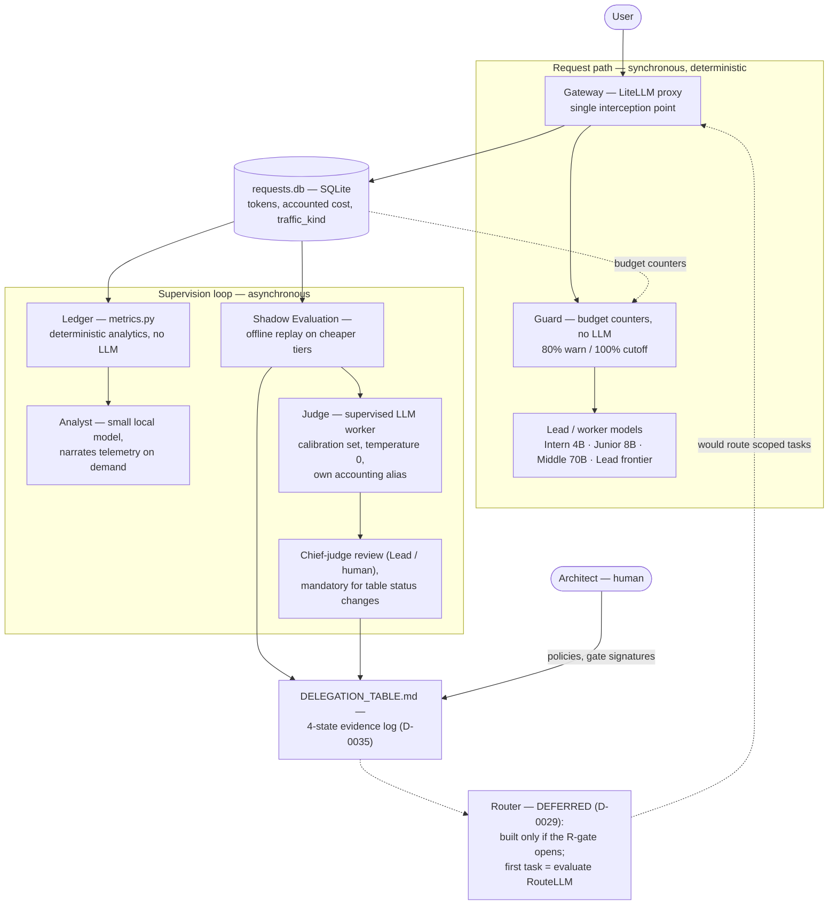

# Supervised Delegation: an Operating System Approach to LLM Cost

**White Paper — living draft v0.1.2 (2026-07-09)**

Status: draft. Every claim in section 7 is backed by repository
evidence (commits, DELEGATION_TABLE.md log, requests.db); numbers
will be revised as telemetry volume grows. Deliverable #1 of
PROJECT_CHARTER.md.

Changelog: v0.1.2 (2026-07-09) — §4.1 (the second contour and policy
portability) and §5.1 (contour asymmetry and the regression bridge)
added, folding in the ARCHITECTURE.md sections of the same date
(operator-ordered record of the policy-portability / Shadow-Eval-
asymmetry discussion). v0.1.1 (2026-07-07) — §4 diagram replaced
with the full target scheme (judge loop, deferred Router) in
Mermaid, per the first Architect review comment. Full sync with
D-0034..D-0038 (two contours, 4-state statuses) is still queued.

---

## 1. Abstract

Frontier LLMs spend a large share of their budget on work that does
not require frontier intelligence: re-explaining context, formatting,
extraction, routine code. The obvious fix — "let a junior model watch
the senior model" — fails as stated, because supervision itself has a
cost and a reliability profile. This paper describes an architecture
that decomposes supervision into three mechanisms with different
reliability requirements (deterministic enforcement, deterministic
analytics, LLM recommendation), binds them with one economic rule —
supervision must cost measurably less than the savings it produces —
and validates every delegation decision with evidence instead of
intuition. The system is deliberately small: a gateway, a SQLite log,
pure-Python metrics, one local model, and an offline replay harness.
Its development process is part of the claim: the project is built by
the same hierarchy it describes, with the repository serving as the
system's persistent memory.

## 2. Problem

The strongest available model (the **Lead**) consumes tokens faster
than any smaller model, does not notice when limits approach, and
external measurements suggest most of its spend is not intelligence
but repetition: 50–62% of token spend in agentic coding sessions is
re-sent conversation history, and 30–40% of tokens are redundant
context re-reading (docs/RELATED_WORK.md). Input tokens dominate
session cost (~85%, input:output ≈ 25:1).

Meanwhile, the naive cost fix — replace the frontier model with a
cheaper one — can backfire end-to-end: production data shows an
identical task taking a frontier model 1 attempt, a mid-tier model
3–5, and a small model 10, erasing the per-token price advantage.

The context cost itself has two distinct layers that require
different fixes:

- **Intra-session:** LLM APIs are stateless, so an agent re-sends the
  entire message history on every call and is re-billed for it as
  input; naive agent loops are quadratic in step count. This layer is
  addressed by context compression (§10) — a mature external tooling
  landscape our system validates rather than reinvents.
- **Inter-session:** each new session starts blank and must re-learn
  project state, either by dragging an ever-growing conversation or
  by a human re-explaining. This layer is addressed by the repository
  as persistent memory (§8).

So the problem is not "use cheaper models". It is: **keep the Lead on
work that needs it, prove which work does not, and make sure the
proving machinery costs less than it saves.**

## 3. Core Insight: Supervision Decomposes

"A junior model watching the senior model" is three different jobs
with incompatible reliability requirements:

1. **Enforcing limits** requires 100% reliability and zero latency.
   This is deterministic software in the request path — never an LLM.
2. **Explaining where tokens go** is analytics over a request log.
   The math is deterministic; an LLM is only needed to narrate.
3. **Recommending delegation** is the only genuine LLM task — and
   even it must be validated against replayed real traffic before it
   changes anything.

**Rule #1: the cost of supervision must be measurably lower than the
savings it produces. A component that violates this rule is removed.**

Everything else in the architecture is a consequence of this
decomposition.

## 4. Architecture

This is the target scheme, drawn honestly: everything with solid
edges is operational today; the Router is drawn dashed because it is
deliberately deferred (D-0029) — it earns its place in the diagram
because the rest of the system exists largely to decide, with
receipts, whether it should ever be built. The judge and chief-judge
loop (§6) is part of the core scheme, not an appendix: it is the
component that turns replay output into evidence. Since 2026-07-07
the same discipline also runs on a second, subscription contour
(Claude Code with tiered subagents, D-0034): §4.1 explains why that
contour is a portability claim, and §5.1 why its evidence stream is
different by design.

The full specification is ARCHITECTURE.md; the reference
implementation is `gateway/`. Design choices that matter for the
argument:

- **One interception point.** All model traffic passes through a
  single proxy. This is what makes enforcement, accounting and replay
  possible at all.
- **The model hierarchy is a delegation ladder**, not an org chart:
  Intern (4B local) → Junior (8B) → Middle (70B-class) → Senior/Lead
  (frontier API) → Architect (human). Work flows down when evidence
  says it can; escalation flows up on failure.
- **Off-the-shelf over custom** (D-0030): the gateway is LiteLLM, the
  log is SQLite, the metrics are pure Python. Custom code exists only
  where it is the contribution: the supervision economics.
- **The Router is deferred** (D-0029). Routing is commoditized
  (RouteLLM); building one before telemetry shows what is worth
  routing would be architecture for its own sake.

## 4.1 The Second Contour: the Policy Is the Router

The operator's real Lead is a Claude Code subscription session, and
it cannot be routed through a proxy (D-0034). On that contour nothing
in the running system is a routing component: routing decisions are
made by the Lead session itself, reading an auto-loaded policy file
(the project's CLAUDE.md); the harness supplies only the dispatch
mechanism — subagents with a model bound per tier (recon on a small
model, implementation-to-spec on a mid model, review on a strong
model). Porting the system to a different model family or harness
therefore means porting a POLICY, not software.

What is substrate-independent by design (D-0005): tiers defined by
FUNCTION (recon / implementation-to-spec / review /
decomposition-and-acceptance), not by vendor models; delegation down
by default with escalation after two rejected attempts; flat
delegation — workers never spawn workers (D-0037); a definition of
done in every dispatch (D-0054); acceptance by trail and witness
(D-0046, D-0052); the journal event vocabulary (D-0053); and the
four-state evidence table with its weekly calibration loop (D-0035,
D-0047). A new deployment must supply exactly four things: a
tier→model binding; a dispatch mechanism the coordinator can
physically call; the policy AUTO-LOADED into the coordinator's
context — delegation is opt-in and silently dies without this
(D-0041; the finding that established it, F-1, is itself journal
evidence); and a telemetry source for calibration (transcripts or a
request log).

Evidence does NOT port with the policy. Table statuses bind a task
type to a CONCRETE model, not to a tier label: "classification →
intern is rejected" is a fact about one 4B model, not about small
models. A new model set starts at `estimated` (D-0028, D-0035) and
earns its statuses through its own acceptance stream or Shadow
Evaluation — the policy tells a new deployment HOW to decide and how
to accumulate evidence, not where its tier boundaries lie. The API
contour already runs non-Claude models under this exact discipline
(a 4B local intern, a 70B middle, a Gemini lead alias): the
discipline was never vendor-specific.

## 5. Evidence-Based Delegation

DELEGATION_TABLE.md is the system's decision surface: task type →
cost of Lead → value of Lead → delegation target → status. Every row
starts as `estimated` and may become `validated` or `rejected` only
with evidence attached (Update Rule 1).

Evidence comes from **Shadow Evaluation** (`gateway/shadow_eval.py`):
a sample of real Lead requests is replayed offline on a cheaper
model, and an LLM judge — never the difflib heuristic alone — rules
whether the cheap answer accomplishes the task as well as the
original. Guards built from early mistakes: a model is never compared
to itself; judge traffic is excluded from sampling; a run aimed at
one table row cannot update rows whose delegation tier differs from
the replay target (`--categories`); comparison must eventually use
total task cost including retry loops, not per-request cost.

The methodology's first real results (n=2 per category, free-tier
models; see §7) already overturned two intuitions: character
similarity is unusable as a verdict (it rejects verbose-but-correct
answers), and "classification is easy for small models" is false in
the one case where reasoning quality mattered.

## 5.1 Contour Asymmetry and the Regression Bridge

Shadow Evaluation exists only on the API contour, and that is a
design decision, not a gap. Replay needs an interception point and a
prompt→text task shape; the subscription contour has neither — the
subscription Lead cannot be proxied, and interactive agentic work
(tools, repository state, multi-turn sessions) does not reduce to a
replayable prompt.

The subscription contour therefore validates delegation in
PRODUCTION instead of counterfactually: work is dispatched down by
default, and the journal measures whether the tier coped —
rejections carrying a failure class, escalations, late defects of
already-accepted work (`defect_found`), and acceptance that must
present evidence (a search trail for recon, an actual test-run
witness for implementation). The weekly calibration aggregates this
stream into table-status movements. The one question replay answers
and this stream cannot — could the work the Lead kept for itself
have gone down? — is compensated structurally: every self-exemption
is a visible journaled event (`dispatch_skipped`, reason mandatory)
audited by calibration, and the policy default is down.

The two streams are bridged, not merged. Accepted journal tasks that
distill to a replayable form (recon questions, spec→diff,
summarization, extraction) become a regression set run on the API
contour when tier models or prices change. The set is biased toward
text-shaped tasks and its evidence is labeled per category, never as
"the whole tier". Replayed traffic is tagged `traffic_kind='replay'`
and never counts toward phase gates — the gates feed on REAL traffic
only (D-0033), and that real-traffic diet is supplied by the
subscription contour. This is also why the API contour needs no
working project of its own to do its lab job: it validates quality
and prices; the money-on-the-table questions are measured where the
real work happens.

## 6. The Judge Is a Supervised Worker

The judge is the architecture's recursive step, and empirically its
most fragile component. Three findings from calibration
(gateway/judge_calibration.json, 13 human-labeled pairs):

1. **Judges fail by capability, not by prompt.** A 70B judge
   consistently ruled a correct fibonacci implementation WORSE. Two
   prompt fixes aimed at the assumed cause (strictness) changed
   nothing; a diagnostic "explain your verdict" showed the model
   hallucinating a bug while tracing correct code. The fix was a
   stronger judge (120B reasoning model, 13/13), not a better prompt.
2. **Judging capability tracks the same hierarchy as working
   capability.** On the identical pair set: 4B misses both hard pairs
   (code tracing + borderline sentiment), 70B misses code tracing,
   120B passes all 13. Judging code is Senior-tier work — catching
   someone else's bug requires solving the task yourself *and* not
   trusting your own hallucination.
3. **Verdicts are stochastic unless pinned.** At default temperature
   a borderline pair flipped between consecutive calibration runs;
   judge calls now default to temperature 0.

Consequently the judge is supervised like any other worker
(PROCESS/JUDGE_CALIBRATION_PROTOCOL.md, D-0031): verdicts that change
a table status require chief-judge (Lead or human) review of the
actual pairs; every reviewed pair grows the calibration set; 1–2
random verdicts are audited per run; recalibration happens every ~5
new pairs; and the judge model is upgraded only on measured agreement
degradation below 90% — never preemptively.

## 6.1 Accounting Prices, Not Cash Prices

Free tiers and local models would make Rule #1 unverifiable if cost
were recorded as cash spent. The system therefore accounts every
alias at a nonzero price — the provider's paid-tier price for
free-tier APIs, synthetic Haiku-class prices for local models — and
treats a free tier as a cash discount, not a cost of zero (D-0032).
Supervision cost (Analyst, judge) is logged under dedicated aliases
so it can never hide inside work-model spend.

## 7. Empirical Status (2026-07-04)

What the evidence currently supports — with honest caveats: total
volume is small (n=2 per category), traffic is synthetic, and the
"Lead" baseline so far is a free-tier frontier-ish model, not a paid
frontier model.

| Claim | Evidence |
|---|---|
| Extraction, formatting, summarization delegate to a 4B local model | Shadow Evaluation, judge-verified, pass_rate 1.00 |
| Routine code generation delegates to Middle (70B) | tier-matching replay, judge pass_rate 1.00, chief-judge review of both pairs |
| Classification does NOT delegate to 4B | judge + manual review agree: flawed reasoning on a mixed-sentiment case |
| difflib similarity is not a verdict | 2 of 5 first-run verdicts were false rejections |
| 70B judge unusable for code pairs | hallucinated bug in correct code, reproduced across independent runs |
| Judge nondeterminism at default temperature | calibration flip 11/11 → 12/13 between consecutive runs |
| Judge capability tracks model hierarchy | 4B: 11/13, 70B: 12/13, 120B: 13/13 on the same pairs |

Supervision cost so far: the judge's accounted spend for the entire
calibration + evaluation history is ~$0.01 against a source traffic
sample accounted at ~$0.03 — trivially satisfying Rule #1 at this
scale, but the ratio only becomes meaningful with production volume.

As of 2026-07-04, Shadow Evaluation reads proxy-accounted costs for
both replay targets and judge calls instead of recomputing costs from
gateway aliases client-side; historical evidence lines dated
2026-07-03 that show `cost_target=$0.0000` are therefore accounting
artifacts, not zero-cost delegation. The same hardening added
`traffic_kind` tagging so Phase 2 gates can distinguish real traffic
from synthetic, replay and judge calls. Both changes are implemented
and self-tested; they still require Lead/Architect review before being
treated as signed process evidence.

External priors the local telemetry must confirm or refute (sources
in docs/RELATED_WORK.md): 50–62% of spend is re-sent history; 30–40%
of tokens are redundant; cascade routing can cut cost up to 98% at
equal quality; cheap models can need 10 retry loops where frontier
needs 1.

## 8. The Repository Is the Operating System's Memory

The second half of the "operating system" claim is not about models
but about state. This is the fix for the **inter-session** layer of
the context cost (§2): sessions become short and disposable — a new
session boots from a curated, compact context instead of dragging a
long conversation, and nothing is lost when it ends. It deliberately
does not address intra-session re-sending; that is Phase 2
compression territory. LLM sessions are ephemeral; the project treats
that as a design constraint, not an inconvenience:

- **Git is the only long-term memory.** No project knowledge may
  exist only in chat history (D-0014). Decisions carry numbered
  entries; recurring practices become protocols in PROCESS/.
- **Boot is standardized.** A new session executes BOOT.md, loads the
  constitution → decisions → operational state, and must emit a
  structured Boot Report before any work (PROCESS/BOOT_REPORT_PROTOCOL.md).
- **Recovery is tested.** Phase 0 closed only after a Zero Context
  Recovery Test: a fresh LLM session resumed the project from the
  repository alone (D-0022, D-0024).

This is self-hosting in the OS sense: the project is developed by the
architecture it describes. The Lead plans and reviews; cheaper
sessions execute specified tasks; the judge is calibrated before its
verdicts are trusted; and the human Architect holds the same role the
architecture assigns — policy, keys, and final review. Several of the
findings in §6 and §7 were produced *by* this process, including two
process failures (sampling contamination; a misdiagnosed judge bias)
that were caught precisely because review steps are mandatory.

## 9. Positioning

Existing work covers routing (RouteLLM, FrugalGPT), observability
(Langfuse, Helicone), enforcement primitives (LiteLLM budgets), and
OS-as-metaphor framings (Karpathy's LLM OS, AIOS, MemGPT). To our
knowledge no open project combines **deterministic budget enforcement
+ spend analytics + evidence-validated delegation as its core loop**,
with the supervision economics (Rule #1) as the design invariant.
Routing itself is commoditized; the contribution is knowing — with
receipts — what to route, and proving the supervisor earns its keep.

## 10. Roadmap

- **Phase 1 (current):** review and sign off the just-landed Shadow
  Evaluation hardening (`traffic_kind` tagging and proxy-accounted
  replay/judge costs); grow real traffic through the gateway; repeat
  the evaluation against a paid frontier Lead when a key is available.
- **Phase 2 (entered on evidence, D-0029, D-0033):** gated by
  explicit telemetry-computable criteria (ROADMAP.md), set up front
  and revised only through the decision log. The router gate requires
  ≥30 judged pairs per category, a validated-delegable share ≥25% of
  the Lead's accounted spend, a stable category mix, projected
  savings ≥3x the router's own cost, and a paid Lead (or explicit
  sign-off on accounted-price justification). The compression gate
  requires local confirmation of the re-sent-context driver (≥40%
  repetition on real multi-turn traffic) and ≥25% of accounted input
  spend in re-sent context. A green gate produces a written report
  and a human signature, not an automatic transition.
- **Phase 2 workstreams (once gated in):** router — evaluate RouteLLM
  before building. Compression follows the same doctrine as routing:
  the tooling is commoditized (LLMLingua-2/PCToolkit at token level,
  Letta-style recursive summarization architecturally — see
  docs/RELATED_WORK.md) and the open question is not *how* to
  compress but *what is safe to compress on our traffic*. That
  question is answered by the existing Shadow Evaluation harness
  unchanged: replay with compressed vs. full context, judge rules
  equivalence, verdict lands in the evidence log.
- **Continuous:** the delegation table and this paper's §7 are living
  documents; every Shadow Evaluation run appends to the evidence log.

## 11. Limitations

Small sample sizes (n=2 per category as of this draft); synthetic
traffic; free-tier baselines instead of a paid frontier Lead; single
machine (6 GB VRAM constrains local tiers to 4B); the judge
calibration set is young (13 pairs) and grows only as fast as
chief-judge reviews happen; retry-loop cost (the strongest external
counter-datapoint to naive delegation) is designed into the method
but not yet measured locally.

---

*Canonical sources: ARCHITECTURE.md (specification), DECISIONS.md
(D-0001…D-0061), DELEGATION_TABLE.md (evidence log),
PROCESS/JUDGE_CALIBRATION_PROTOCOL.md, docs/RELATED_WORK.md,
gateway/ (reference implementation).*
