# POLICY_FULL — полная политика с обоснованиями (архивный дом, D-0084)

Это ДОСЛОВНЫЙ текст CLAUDE.md на момент N3-среза 2026-07-19 (три
экзамен-точки ядра 0.94/0.90/0.92, слово оператора «да делай 1»).
Нормы живут в CLAUDE.md (ядро, EN); здесь — обоснования, прецеденты
и датированная история, на которые ядро ссылается. Пара оси 4
SIBLING_MAP: норма меняется в ядре, её rationale дописывается сюда
тем же коммитом. При расхождении НОРМА ядра выигрывает; этот файл
не грузится на буте.

---

**N3-снимок вынесен (диета 2026-08-27).** ДОСЛОВНЫЙ текст CLAUDE.md
N3-среза (2026-07-19), ранее лежавший здесь целиком (шапка/Ярусы/
Правила маршрутизации/Журнал/Роль ≠ ярус/Деградация Lead/Командная
гигиена) — в docs/task_reports/2026-08-27_policy-full-n3-snapshot.md
(там же реанимационное правило). Живые амендменты, встроенные в
снимок (11(q)/D-0106, п.6(а)/D-0105), вынесены отдельными ##-секциями
ниже. При расхождении НОРМА ядра CLAUDE.md выигрывает.

## R13 — Leaf routing (D-0087, 2026-07-21): rationale

Приз измерен чеком 11 трёх калибровок: координационные накладные
Lead ~85% дневного спенда (1.27–1.7× стоимости делегируемых работ),
и копятся они на ПО-ЛИСТОВОЙ рутине — диспатч/приёмка/журнал каждой
клетки. Серии D№1–№6 (ключи R4' предрегистрированы и взяты) показали:
на рутинных листьях конструкция «allocate-таблица + судья + зеркало
R6» даёт $2.08/принятую против B-медианы $3.89 при качестве 0.975
ПРОТИВ B_ref 0.92 и времени в ключе (17.1 ≤ 18 мин параллельным
лаунчем). Судья на листьях — не штамп: трижды из трёх реджектил
кнопочный калькулятор (2+2*2=8) и доводил ретраем/эскалацией до
парсера — класс, который соло-плечи и C-плечо сдавали багом во всех
прогонах. Большой гибрид-экзамен H1 дал границу применимости: на
ГРАФЕ Lead-слой (DAG+ключи+интеграции) дал лучшее качество истории
набора №2 (1.0 против 0.86) при цене 2.2× плеча C — поэтому H-режим
не дефолт, а опция по слову для качество-несущих задач. Шесть
LLM-роутер-кандидатов двух волн отклонены evidence'ом (Arena-сигнал
слеп к супервизионным рефлексам; few-shot на 21 ярлыке
коллапсирует) — классификация лист/граф остаётся суждением Lead по
правилу (одно суждение на задачу), не LLM-компонентом. Ошибки
классификации самовосстановимы и асимметрично дёшевы (граф-как-лист
вернётся judge-reject/decomposable; лист-как-граф платит ~+$1.5
налога Lead-слоя — замер календаря H1). Прецеденты дня: галлюцинация
судьи (1 суд из 8, чек 30 несёт выборочную сверку оснований);
испарение evidence безжурнальных конструкций (3 случая) — почему
судейский вердикт ПИШЕТСЯ в журнал с basis, а не живёт в чате.

Дополнение того же дня — вторая форма судьи (вопрос оператора
«зачем через шлюз, если судья всё равно сонет»): подписочный
судья-субагент с дословным шлюзовым промптом снял прокси-зависимость
приёмки листа в живых сессиях (касса ~0); шлюзовая форма — для
скрипт-конструкций и калибровки. Точка эквивалентности 13/13 на
сете D-0031 (t-254) снята до правки; отдельная оговорка: «судья» —
это калиброванная привязка (модель+промпт+параметры), не модель, —
поэтому дословность промпта субагентной формы сторожится чеком
30(а), а её экземпляр без точки эквивалентности судьёй не является.

Прецеденты применения R13, стоящие как записанные трактовки (перенос
из CURRENT_CONTEXT 2026-08-05, шаг 5а диеты — норма и её прецеденты
живут парой ядро↔этот файл): (1) t-264 — трактовка R3-порога по
НЕСУЩЕЙ ПОВЕРХНОСТИ диффа (не по сырому счёту строк) принята аудитом
чека 30 калибровки №4, прецедент стоит; (2) t-286 — форма записанной
причины отклонения от D-путём (её же требует ядро R13, детектор —
чек 30); (3) промоция MAY→дефолт (D-0094) исполнена по чистому аудиту
чека 30 калибровки №4, окно и вердикты — notes calibrated
07-23T14:44.

## R4 — owns на пишущих узлах DAG (2026-07-28): rationale

Дополнение нормы R4/D-0080 («nodes/statuses/tiers» → «+ owns на
пишущих узлах»): узел DAG, чья работа пишет файлы, объявляет свои
owns-пути прямо в карточке узла. Источник — разбор инсайт-отчёта
харнесса 07-28 (класс «почти-коллизий» параллельных воркеров) и
слово оператора: слой 1 защиты — машинная сверка непересечения
(tools/owns_gate.py, warn-first) читает owns из промптов диспатчей,
а DAG-узлы копят те же декларации на уровне ПЛАНА — данные для
будущего планировщика максимальных непересекающихся батчей
(evidence-gated reopen-триггер Phase 2 «большая параллельность»)
собираются бесплатно с каждой задачей. Цена: одна строка на пишущий
узел; читающие узлы не обязаны. Полный планировщик сознательно НЕ
строится до данных (Rule #1; анти-цель «architecture for
architecture's sake»).

## designer — стоячая функция (промоция калибровкой №5, 2026-07-29): rationale

Норма ядра (таблица ярусов + R2): designer (Opus) драфтит спеку по
интент-брифу Lead в форме R11; РАЗВИЛКИ ВОЗВРАЩАЮТСЯ списком с
рекомендацией, молчаливое решение развилки — нарушение роли; драфт
проходит приёмку Lead ДО использования любым диспатчем (D-0037 —
декомпозиция и приёмка остаются у координатора; дизайнер снимает
только ПИСЬМО спеки). Улики пилота (docs/tasks/
2026-07-14_opus-designer-pilot.md; счёт — SHADOW_EVALUATION_LOG
«DESIGNER PILOT CLOSING»): 3 дизайнер-точки + t-223 против 3
контролей — 0 rejected-спек на приёмке, 0 перевёрнутых развилок из
27 закрытых сам (drift не пойман), единственная spec-ловушка окна
двусторонняя (прошли ОБЕ группы, поймал critic — точка не
дискриминирует), t-223: 3/5 рассогласованных пар пойманы в брифе ДО
прогонов. Цена: 71–166K opus-side токенов на спеку против
Fable-письма (~4x дешевле за ход); Rule #1 в пользу функции.
Оговорки записаны в evidence-строке (малый n, сбитое чередование
прогона 5); production_validated — по неделям реального применения.
Детекторы: чек 13(г) (failure_class=spec на дизайнере), метрики
пилота остаются рабочей рамкой; экзамен-набора НЕТ по записанному
решению (ось 8: выход принимается Lead'ом на каждой задаче, как у
builder). Прецеденты рисков, закрытые формой роли: C-T1 (молчаливое
решение развилки), read-only tools без Task/Agent/Edit/Write —
плоскость и невозможность самоактивации машинным слоем (D-0069
не задевается: дизайнер в дерево не пишет вовсе).

ПОРОГ ПО УМОЛЧАНИЮ (2026-08-05, слово оператора; дополнение R2/R8):
rationale. Замер калибровки №6, поднятый ВОПРОСОМ ОПЕРАТОРА («сколько
раз вызывался дизайнер, я его не видела»): 5 designer-диспатчей за всю
историю против 480 builder и 340 scout, причём с фактически
загруженным роль-файлом — ОДИН (t-345; четыре пилотных шли
general-purpose, роль-файл создан лишь коммитом промоции 2fa220d).
Диагноз: роль была ОБЪЯВЛЕНА стоячей, но нигде не сделана ДЕФОЛТОМ —
асимметрия с R1, где «разведка → scout по умолчанию» подпёрта
обязанностью skip-события. Функция без дефолта и без обязанности
отчитаться за её пропуск не используется — это подтвердилось на самом
Lead: в день введения нормы координатор написал три спеки подряд
(t-353/t-354/t-355, все три ≥3 пунктов) сам, не заметив пропуска.
Порог выбран машинно-проверяемым (≥3 нумерованных пункта ИЛИ ≥3
файла), чтобы детектор чека 1(б) был дешёвым grep'ом по журналу и
owns-строкам, а не суждением.
ПОЧЕМУ SKIP-СОБЫТИЕ ОБЯЗАНО, ХОТЯ ЯРУС ТОТ ЖЕ. После D-0099 Lead и
designer — оба Opus, экономии по цени модели больше нет; прежняя
редакция R8 говорила о «более дешёвом ярусе» и на этот случай
формально не распространялась. Правка R8 переносит обязанность с
РАЗНИЦЫ ЦЕНЫ на МОТИВ МАРШРУТИЗАЦИИ: designer маршрутизируется ради
изоляции контекста (контекст Lead — самый дефицитный ресурс, D-0040)
и ради независимого контекста драфта; поглощение такой функции
координатором — то же самое молчаливое самоизъятие, что и чтение
вместо scout, и стоит столько же в потерянной видимости.
ОГОВОРКА ЭКСПЕРИМЕНТА (слово оператора 2026-08-05): роль сохраняется
в том числе потому, что возможен возврат привязки Lead на Fable —
тогда ценовой мотив вернётся сам собой, и норма уже будет стоять.
Детектор нормы — чек 1(б) протокола калибровки (пара «пишущий
диспатч выше порога ↔ designer-диспатч либо skip»), плюс тренд доли
против baseline замера №6.

КРАЙ: ПОВТОРНАЯ ПОДАЧА ПОД ТЕМ ЖЕ TASK_ID (2026-08-09, слово
оператора). Порог считает ПЕРВИЧНЫЙ драфт задачи. Пересдача после
`rejected` — ретрай под ТЕМ ЖЕ task_id — это ПРОДОЛЖЕНИЕ существующей
спеки: Lead правит её САМ, без designer-диспатча и без
`dispatch_skipped`, независимо от порога ≥3 пунктов / ≥3 файлов.
Работа, переоформленная под НОВЫЙ task_id, — новая задача, и порог
применяется к ней как обычно; части, порождённые после
`decomposable`, получают новые task_id и каждая судится по порогу
отдельно. Rationale: край не был назван автором нормы при вводе
порога 2026-08-05, вскрыт Fable-ревью первой Opus-Lead сессии, закрыт
словом оператора 2026-08-09. Граница проведена по task_id, потому что
она уже машинно различима: ретрай с attempt≥2 после rejected несёт
тот же task_id (D-0053), новая подача — новый id per правило выдачи
(перечитывание хвоста журнала). Попутно отмечено расхождение
mermaid-диаграммы жизненного цикла (секция журнала) с фактическим
поведением `journal_validator`: диаграмма помечала
`escalated`/`decomposable` переходом в Closed, хотя `tools/
journal_validator.py` закрывает задачу (D-0060 reopen-forbidden)
только событием `accepted` — расхождение снято правкой диаграммы тем
же коммитом (Open --> Open).
Rationale (F11, вердикт критика, уточнение того же дня): первая
редакция скобки («only accepted or a closes: token actually closes»)
сама оказалась верна лишь для ОДНОГО из двух машинных читателей
состояния. `tools/journal_validator.py` (закон D-0060) закрывает
task_id ТОЛЬКО событием `accepted` — ни `escalated`/`decomposable`,
ни токен `closes:t-NNN` там задачу не закрывают, повторный `delegated`
после них легален. `tools/session_context.py`,
`open_dispatches()` — второй читатель, с более узким окном:
task_id открыт, только пока его ПОСЛЕДНЕЕ lifecycle-событие
(delegated/accepted/rejected/escalated/decomposable) — `delegated`;
после `escalated` или `decomposable` — или более позднего токена
`closes:t-NNN` в notes ЛЮБОГО события — задача молча пропадает из
OPEN DISPATCH на буте, оставаясь при этом открытой для валидатора.
Скобка исправлена: короткая строка диаграммы отсылает к прозе под
ней, называющей ОБОИХ читателей и их разное поведение вместо одного
утверждения на двоих (проверено чтением
`tools/session_context.py::open_dispatches()` и
`tools/journal_validator.py::_harvest_line_into` — не по памяти).

## R11 — края поведения в спеке (2026-07-29, предложение оператора): rationale

Дополнение нормы R11/чеклиста D-0096 п.2: рядом с DoD спека обязана
НАЗВАТЬ края поведения — ожидаемое поведение на каждом вводимом ею
лимите/усечении, на пустом/отсутствующем входе её данных и при
конфликте пары её собственных требований; альтернатива одна — явно
отдать развилку вниз вопросом. Источник — атрибутивный чек 23
калибровки №5: кластер (б) диспетчера, 4 кейса одного корня
«спека молчит или противоречит себе на краю, который её же
требования создают» (t-325 — поведение НА лимите MAX_LINES не
оговорено; t-324 — DoD-пункт конфликтовал с безусловным дефолтом,
край data=None; t-343 — конфликт примеров скоупа; t-332 —
непокрытые ветки, две R6-эскалации). По правилу чека 23 кластер
≥2 обязан осесть уточнением чеклиста тем же прогоном — калибровка
№5 недоисполнила это для класса (б) (промотировала только класс
(а) в машинный слой); закрыто настоящей правкой по предложению
оператора. Цена: строки на пишущий диспатч против четырёх
критик-кругов за окно — Rule #1 в плюс. Слой: дисциплина чеклиста;
семантику «края действительно описаны» машинно не решить (D-0063
— решаемое кодом здесь только наличие маркера, что порождало бы
карго-культ); детектор — чек 23 (атрибутивный счёт класса (б)
следующего окна) + возвраты-вопросами исполнителей (аварийная
сетка R11) как рантайм-сигнал; маркер-warn в dispatch_gate —
кандидат промоции по лику, не строится заранее. Роль designer
несёт то же требование своим п.1 (форма R11 целиком).

ДВА ПОДКЛАССА КРАЯ (2026-08-05, калибровка №6): счёт чека 23 за окно
07-29..08-05 дал кластер ДИСПЕТЧЕРА 4 при кластере исполнителя 2, и
два кейса одной задачи t-350 показали, что исходная формулировка
края их не покрывает буквально — оба прошли мимо неё и стоили
критик-раунда с блокерами B1/B2.
(i) ВРЕМЕННОЙ край: спека перепривязки Lead требовала читать
delegation.config.yaml, которого в дереве ещё НЕ БЫЛО — «конфиг
появится позже» ни спекой, ни DoD названо не было; исполнитель
разумно сделал ленивый дефолт, и тот привязал пять СТАРЫХ тестов к
будущему реальному конфигу (блокер B1). Класс: артефакт, который
сама правка вносит в мир, — это край, у него два мира (до и после),
и спека обязана назвать поведение в обоих и сказать, чей ход его
создаёт. Прежняя формулировка говорила о «пустом/отсутствующем
ВХОДЕ ДАННЫХ» — про несуществующий пока НОСИТЕЛЬ она молчала.
(ii) ПОЗИЦИОННЫЙ край: та же спека предписала место новой ветки
матрицы («между judge и ok_tier»), не назвав инвариант, который это
место обязано сохранить; ветка встала ВЫШЕ безусловного floor и при
haiku-привязке легализовала приёмку scout самим haiku (блокер B2,
доказан пробой критика). Класс: предписанная позиция без своего
инварианта — догадка диспетчера, выданная исполнителю за факт;
исполнителю нечем её проверить, потому что критерий не назван.
Цена подклассов: две строки на диспатч, предписывающий позицию или
создающий носитель. Слой — тот же (дисциплина чеклиста п.2, машинно
неразрешимо); детектор — тот же чек 23 следующего окна: рецидив
любого из двух подклассов = утечка кодификации.

ТРЕТИЙ ПОДКЛАСС: ГЕНЕРАТИВНЫЙ (2026-08-20, ремедиация калибровки №8,
узел G; СЧЁТ 4 — база окна №7, четыре экземпляра ниже; окно №8 дало ещё
два, они перечислены там же). Оба прежних подкласса читают край как СВОЙСТВО
уже названного объекта (носитель существует позже/раньше; позиция уже
предписана) — ни один не покрывает случай, когда САМО требование
спеки РОЖДАЕТ артефакт, случай или ветку, которых до него не было, и
спека о рождённом молчит. Прецеденты ОКНА №7 (счёт 4, атрибутивный чек
23): t-365, t-367, t-423, t-369 (батч 3,
2026-08-14, восстановленный драфт `docs/tasks/
2026-08-14_calibration-7-batch3-spec.md`) — норма рождала артефакт или
случай, которых сама не называла. Экземпляры ОКНА №8 (два, в счёт базы
не входят): чек 11(в) отчёта №8 — норма назвала предмет замера именами
warn-слоёв, которых нет в выводе хука; и узел F0
доклада (2), 2026-08-20: пункт 4 командной гигиены («File edits —
только через Edit/Write») не различал ad-hoc инлайн-мутацию
(`python -c`/heredoc по живому файлу) и программный перенос текста
именованным скриптом с приложенным исходником, независимой пересверкой
sha256 и негативным контролем на копии — Lead разрешил отклонение
вручную сам, потому что норма не называла ни носителя, ни
классификации этого случая. Класс: требование спеки САМО рождает
артефакт/случай/ветку — спека обязана назвать (а) НОСИТЕЛЯ рождённого
(файл/поле/событие — где он живёт), (б) его КЛАССИФИКАЦИЮ
(механизменный путь или нет; есть ли парная сущность — ось 4/реестр/
детектор; кто владелец), либо явно отдать развилку вниз вопросом;
молчание — дефект диспетчера, той же атрибуции, что и первые два
подкласса, не догадка исполнителя. Цена: строка на диспатч, чьё
требование создаёт то, чего раньше не было. Слой — тот же (дисциплина
чеклиста п.2, машинно неразрешимо: код не судит, названы ли носитель и
классификация ПРАВИЛЬНО, только их присутствие в тексте — карго-культ
того же рода, что и у первых двух подклассов); детектор — чек 23
следующего окна: рецидив ГЕНЕРАТИВНОГО подкласса = утечка кодификации.

## Чеклист D-0096 п.3 — достаточность по инструментам (2026-08-20, ремедиация калибровки №8, узел G; счёт 3 в окне №7 + экземпляр окна №8 — t-544): rationale

Прежняя форма п.3 («given» enumerated AND sufficient) проверяла
достаточность корзины только по ДАННЫМ — фактам, добываемым чтением.
Молчала про ИНСТРУМЕНТЫ исполняющего яруса: DoD мог поручить факт,
добываемый инструментом, которого у роли нет (`git log`, живое
состояние процесса/сети — недостижимы для scout/designer/judge по
конструкции их frontmatter `tools:`), и тогда исполнитель либо
угадывал обходной путь сам, либо честно останавливался и возвращал
вопрос — в обоих случаях это симптом дефектной спеки, а не нехватки
исполнителя. Живой прецедент (счёт 4 по атрибуции чека 23; предыдущие
три экземпляра — вне корзины этого диспатча, они в отчётах прежних
окон), последний — мой: DoD разведдиспатча t-544 требовал источником
`git log`, а у роли scout в этом контуре нет Bash; исполнитель честно
объявил границу и отработал по журналу, но сама спека была дефектной
на этом крае. Норма: достаточность корзины «given» проверяется не
только по данным, но и по ИНСТРУМЕНТАМ исполняющего яруса — факт,
добываемый инструментом, которого у роли нет, диспетчер обязан
ПОЛОЖИТЬ В КОРЗИНУ готовым (вывод прогона, дословная выписка), а не
поручить к добыче; поручение такого факта = spec-дефект диспетчера
(тот же класс чека 23), не «исполнитель не справился». Правило не
вводит нового обязательного поля манифеста — диспетчер просто обязан
СВЕРИТЬ корзину против инструментов адресата перед отправкой. Граница
маршрута добычи живёт В ЯДРЕ («pre-fetched by the dispatcher's own
R1/R8(f)-legal route», чеклист п.3), здесь — только её рационал: норма
НЕ легализует самостоятельное добывание координатором факта в обход
маршрута — разведка идёт в scout со skip-событием (R1), а
детерминированный прогон есть операция среды и события не требует
(R8(f)); запрещено ровно поручать недостижимое. Цена:
одна проверка на пишущий диспатч. Слой — тот же (дисциплина чеклиста,
машинно неразрешимо: код не знает семантики факта); детектор — чек 23
следующего окна.

## Витнесс доковой диспетчеризации (2026-08-10, вердикт критика t-407): rationale

Прецедент: ветка B6 батча v0.8.0 (owns — markdown/yaml без
собственного тест-сета) сдала витнессом самописный скрипт из
scratchpad, повторно исполняющий греп-ключи её же DoD. Критик
разобрал форму: она законна ПО ПРИНЦИПУ (R11/D-0052 требуют «точный
прогон, чей вывод — витнесс», не pytest как таковой; для доков
pytest-мишени может не существовать), но конкретный экземпляр нёс
три дефекта, каждый из которых превращает прогон в пересказ:
скрипт вне репо — приёмщик не может перепрогнать (право дешёвого
ре-рана R12 недоступно, остаётся вера); ключи не привязаны к DoD,
написанному ДО прогона — исполнитель, выбирающий ключи постфактум,
проверяет сам себя; присутствие ключа доказывает, что строка легла,
но не что легла СВЯЗНО. Норма (ядро, R11): три свойства (i) ключи
дословно из DoD-до-прогона, (ii) скрипт закоммичен тестом либо
приложен полным исходником, (iii) обязательный негативный контроль —
вечнозелёный скрипт, не умеющий падать, неотличим от сломанного.
Лучшая форма уже отгружена тем же батчем: test_findings_form —
репозиторный тест формы для markdown-шаблона; норма тянет доковые
витнессы к этому образцу, не запрещая лёгкую форму. Цена: минуты на
негативный контроль против принятия непроверяемого витнесса. Слой:
дисциплина приёмки; детектор — чек 13(л) (витнессы доковых
диспатчей окна против трёх свойств; скрипт-витнесс без негативного
контроля = находка). Кит-зеркало — тем же коммитом (D-0101).

**Остаток «Диеты ядра 08-16» вынесен (диета 2026-08-27).** Вступление
блока и нарратив «Что осознанно не тронуто» + «Диета W2c-1 2026-08-19»
— в docs/task_reports/2026-08-27_policy-full-n3-snapshot.md, раздел 2.
Амендмент-рационалы живых правил, прежде бывшие ###-подсекциями этого
блока, подняты до ##-секций ниже (R2/R4/R8/R11/R13/Таблица ярусов/
Командная гигиена п.4/п.6/R13(g)/R1(d)/Диета слоя CLAUDE.md 08-25/
Журнал-диаграмма/Командная гигиена п.7).

## R2 (designer) (вынесен из блока «Диета ядра 08-16» диетой 2026-08-27)

- «The designer is a STANDING function **since calibration #5
  (2026-07-29, provisionally_validated)**».
- «DRAFTING → designer BY DEFAULT **(2026-08-05, operator's word after
  the calibration-#6 measurement: 5 designer dispatches all-time
  against 480 builder and 340 scout — the function existed but was
  never routed to)**».
- «This skip obligation holds even though designer is NOT a cheaper
  tier than the Lead **(both Opus under the D-0099 binding)**» —
  снято ещё и потому, что это прибитая в норме привязка: класс «имя
  модели как критерий», заведённый в реестр режимов отказа карты
  2026-08-16. В ядре осталась формулировка через ЯРУС («even when
  designer and Lead sit on the SAME tier»), не через имя модели.
- «…regardless of the ≥3-items / ≥3-files threshold **(operator's
  word, 2026-08-09)**».
- «**Pilot protocol and evidence:
  docs/tasks/2026-07-14_opus-designer-pilot.md.**» — носитель жив,
  ссылка теперь отсюда.

## R4 (параллель, витнесс-область) (вынесен из блока «Диета ядра 08-16» диетой 2026-08-27)

- «the canon addition never replaces the node's own proof **(the
  journal schema is unchanged, this reuses the existing
  accepted/witness slot)**» — пояснение о реализации, не норма.
- «a WRITING node also declares its owns paths **— rationale in
  POLICY_FULL, 2026-07-28**» — дата снята, сам указатель на этот файл
  избыточен внутри этого файла.

## R8 (универсальное правило пропуска) (вынесен из блока «Диета ядра 08-16» диетой 2026-08-27)

- «The rule follows the ROUTING MOTIVE, not the price gap
  **(2026-08-05)**».
- «…it is the very shape the loophole took **(calibration #6,
  check 22, count 3)**».

## R11 (DoD, края, чеклист диспетчера) (вынесен из блока «Диета ядра 08-16» диетой 2026-08-27)

- «AND the spec names its EDGE BEHAVIOR **(2026-07-29, check-23 class
  (б) codification)**».
- «a spec silent on an edge its own requirements create is a
  dispatcher defect **(check-23 attribution)**».
- «Two sub-classes of that edge, both dispatcher defects when silent
  **(2026-08-05, calibration #6, cases t-350 B1/B2)**».
- «stated, or explicitly forked down **(2026-07-29, check-23 class
  (б) — cases t-324/t-325/t-332/t-343)**».
- «machine layer **since t-343** — the dispatch_gate given-path warn».
- «A checklist miss exposed by a reject or finding = a spec-defect of
  the dispatcher **(check-23 case)**».
- «DOC-DISPATCH WITNESS **(2026-08-10, критик t-407 по прецеденту
  витнесса B6 батча v0.8.0)**».

## R13 (лист-роутинг) (вынесен из блока «Диета ядра 08-16» диетой 2026-08-27)

- «A leaf runs through the D-construction BY DEFAULT **(D-0094 — MAY
  promoted to default on the clean check-30 audit of calibration #4,
  2026-07-23)**».
- «legal ONLY with a recorded reason in the journal **(t-286 form;**
  the window detector is check 30**)**».
- «a negative claim in the material without its positive same-form
  control → reject **(check-20 cases t-268/t-272 — the miss passed
  two judges)**».
- «a SUBSCRIPTION judge-subagent carrying the pinned
  JUDGE_SYSTEM_PROMPT (gateway/shadow_eval.py) VERBATIM — **equivalence
  point 13/13 on the D-0031 set (t-254, 2026-07-21)**; a drifted
  subagent-judge prompt is a finding, not a judge». Это ЕДИНСТВЕННОЕ
  основание, по которому подписочная форма судьи вообще легальна:
  13 из 13 совпадений вердиктов с гейтвейной формой на калибровочном
  наборе D-0031. Ядро теперь ссылается сюда.

## Таблица ярусов (вынесен из блока «Диета ядра 08-16» диетой 2026-08-27)

- «**D-0099 (2026-08-04, operator's word, cost motive): Lead rebound
  Fable→Opus 5; Fable is the RESERVE tier ABOVE the Lead binding**,
  summoned only by the operator's word for the hardest cases.» — в
  ядре осталась норма без имён моделей: резерв живёт ключом
  `roles.reserve` и входит только по слову оператора.

## Командная гигиена п.4 — амендменты а/б (D-0109, 2026-08-25) (вынесен из блока «Диета ядра 08-16» диетой 2026-08-27)

- Живой прецедент строки (а): ремедиация №8, узел G
  (docs/tasks/2026-08-20_calibration-8-remediation.md:279-292) —
  перенос ~90 тыс. символов именованными скриптами с приложенным
  выводом, пересверкой и негативным контролем дал БОЛЬШУЮ
  аудируемость, чем ручной путь; норма этот случай не называла
  (генеративный край).
- Вход строки (б) — со стороны кода: 08-21 три ложных срабатывания
  за вечер на `python -c "print(1+1)"` — предикат был токенным,
  «инлайн-мутация» и «разовый расчёт» неразличимы. Правка кода
  (t-605): три класса payload при certain-извлечении — мутация WARN,
  доказанная чистота (AST + алиас-карта импортов, вердикт критика об
  осях A/B учтён) — тишина, непрозрачность — WARN новым текстом;
  неуверенное извлечение (обёртки/проза) — класс U, старое поведение.
- Почему deny НЕ сужен: pyc_certain/PYC_DENY_ENABLED — отдельная
  ветка; асимметрия (чистый payload молчит в warn-режиме, но денается
  при включённом выключателе) принята сознательно и запинена тестом.
- Почему «именованный скрипт» — норма, а не код: `python <path>`
  вообще не матчится предикатом; недостающее (вывод приложен,
  негативный контроль) — свойство ОТЧЁТА, PreToolUse-хуку недоступное.

## Командная гигиена п.6 — амендменты б/в (D-0107/D-0108, 2026-08-25) (вынесен из блока «Диета ядра 08-16» диетой 2026-08-27)

- (б) «число замера с носителем счёта»: шесть замеренных экземпляров
  класса — четыре из калибровки №8 (19 файлов против 21; 121 тест
  против 279; 50 parity-пар против 97; «12 артефактов» против 15) и
  два свежих 08-25: находка F11 сравнила БАЙТЫ окна с СИМВОЛАМИ
  базлайна (43%→«79.5%» оказался 43%→38.9% в единой метрике), и сам
  Lead в тот же день оценил байты правок ядра числом символов.
  Носитель счёта = файл/команда/скрипт, которым число снято; число
  без носителя не пишется. Детектор — подпункт (а) чека 24.
- (в) «посимвольное только по Read»: прецедент — драфтер прочёл
  прямой слэш как обратный в выводе поисковика и объявил живой дефект
  гейта; опровергнуто чтением. Утверждения о символе/регистре/
  направлении слэша валидны только по Read носителя. Детектор —
  класс-лист чека 25.

## R13(g) — судья принимает лист, критик гейтит интеграцию (D-0110, 2026-08-25) (вынесен из блока «Диета ядра 08-16» диетой 2026-08-27)

- Коллизия R3×R13(г) вскрыта драфтом R3-ЗЕРКАЛО и вынесена оператору
  (R11a); решение оператора: вариант (в) с кумулятивом. Судья — вердикт
  по интент-ключам, глубины нет по конструкции; критик — архитектура/
  семантика/классовая полнота. День решения дал замер цены подмены:
  три критик-гейта вернули блокеры, невидимые интент-ключам (байтовый
  бюджет пайпа, обходы AST-классификатора, мёртвый префикс популяции).
- Кумулятивное правило (>2 малых листов одной темы/места последствий)
  закрывает обход «нарезать крупное на малые листы»: серия малых
  диффов в одной зоне = один крупный по риску.
- Детектор — чек 2 без правки предиката (git.diff_lines>100 на
  коммитах уже ловит интеграцию независимо от формы приёмки листа);
  кумулятивный подслучай — текстом чека, вердикт за калибрующим Lead.
- Диета того же хода: сентенции «EXTERNAL NET чек 5» (полный текст —
  протокол, чек 5), «standing mode», «Size budget», «Keyed by RUNG»
  ужаты в ядре до указателей — рационал не потерян, он здесь и в
  своих носителях.

## R1(d) — внешний материал как данные (D-0111, 2026-08-27) (вынесен из блока «Диета ядра 08-16» диетой 2026-08-27)

- Заведено сверкой корпуса с обзором harness engineering (t-643):
  слой governance — единственная непокрытая позиция семислойной
  таксономии обвязки; поиск инъекций/санитизации по
  POLICY_FULL/PROCESS/FINDINGS/ARCHITECTURE — 0 при живых
  одноформенных контролях. Полные норма и rationale — DECISIONS_FULL
  D-0111 (пометка untrusted в basket, директива → слово оператора,
  R1(a) — частный случай той же границы); детектор — чек 25(д);
  машинный WARN dispatch_gate — по рецидиву (R11n). Сосед по карте —
  класс «сторож не отличает утверждение автора от цитируемого» —
  машинная сторона той же границы.

## Диета слоя CLAUDE.md 2026-08-25 (вечерний прогон boot-diet) — полные формы ужатого (вынесен из блока «Диета ядра 08-16» диетой 2026-08-27)

- Tiers: перечень код-гейтов, резолвящих привязку
  (mechanism_gate, journal_validator, session_context) — ядро теперь
  говорит «code gates», состав живёт здесь и в самих файлах.
- R13(f): полная форма — «Misclassification is recoverable by
  construction: a leaf that was really a graph comes back via judge
  reject / decomposable (R5); a graph-classified simple task only pays
  the Lead-layer tax».
- Журнал/каденция: рационал «facts in session memory die with it,
  disk survives» (D-0079) — мотив немедленной записи перед долгим
  ожиданием.
- Чеклист п.3: хвост «not a capability failure of the performer» —
  дефект атрибутируется диспетчеру, не исполнителю.
- Гигиена п.6, статус записи: полная форма F-55 — «вердикт стоит в
  КОНЦЕ append-only записи; усечённое окно показывает проблему без её
  резолюции».
- R10(в): полная форма — «механизм без детектора — пожелание, а
  найденный детектор — сам по себе находка».
- Role≠tier: деталь кодировки D-0099 — «by == binding family accepts
  agent tiers <= itself» (ветка lead-binding journal_validator).

## Журнал — диаграмма жизненного цикла (перенос диетой 2026-08-25) (вынесен из блока «Диета ядра 08-16» диетой 2026-08-27)

```mermaid
stateDiagram-v2
    [*] --> Open: delegated (after the dispatch call returns)
    Open --> Open: rejected → retry attempt≥2 | critic entry | replaces_worker
    Open --> Closed: accepted (from above / basis critic / queued-to-lead)
    Open --> Open: escalated / decomposable → re-dispatched (same task_id)
    Open --> Closed: closes:t-NNN token in a later event's notes
    Closed --> [*]: reopen forbidden (D-0060); late defects → defect_found(ref)
```

Полная форма абзаца «Closure is reader-specific» (ядро несёт сжатую):
journal_validator (закон reopen-forbidden D-0060) закрывает task_id
ТОЛЬКО по `accepted` — `escalated`, `decomposable` и токен
`closes:t-NNN` там НЕ закрывают, поэтому повторный `delegated` после
escalated/decomposable легален для валидатора. `open_dispatches()`
session_context (строка OPEN DISPATCH на SessionStart) уже́: task_id
ОТКРЫТ, только пока его ПОСЛЕДНЕЕ жизненное событие
(delegated/accepted/rejected/escalated/decomposable) — `delegated`;
после escalated/decomposable — или позднего `closes:`-токена в notes
ЛЮБОГО события — он тихо уходит из бут-списка, хотя валидатор всё ещё
считает задачу открытой. Оба читателя согласны лишь в том, что
`accepted` закрывает безусловно.

## Командная гигиена п.7 (откат порчи байтовой копией) (вынесен из блока «Диета ядра 08-16» диетой 2026-08-27)

- «**(2026-08-05; AO3 cross-point of 08-02 confirmed on our side by a
  live case: our own critic corrupted the MONEY table
  logs/token_usage.xlsx to prove a guard hole — the probe itself was
  right and valuable — and rolled it back with `git checkout --
  <file>`, the idiom that wipes ANOTHER session's uncommitted changes
  to that file along with the corruption)**». В ядре осталась причина
  без нарратива: «that idiom wipes ANOTHER session's uncommitted
  changes to the file along with the corruption».
- «corrupt a COPY of the tree instead **(precedent the same day: the
  judge-pin liveness probe ran on corrupted COPIES, the live role file
  untouched)**».

## Role ≠ tier: разное лечение частям секции (2026-08-16, слово оператора)

Секция несла имена моделей в четырёх местах, и это тот самый класс
«имя модели прибито как критерий». Но F-31 дословно охраняет только
«the three definitions below», а матрица идёт ПОСЛЕ них. Вопрос был
поднят оператору, а не решён самостоятельно: чтение «защита покрывает
только названное» я в этот день уже применил один раз (к секции
деградации, критик подтвердил), и растянуть его второй раз собственным
суждением значило бы размывать защиту тем же способом, каким её обычно
и размывают.

Решение оператора — разное лечение частям, и вот его основание.

МАТРИЦА ПЕРЕВЕДЕНА НА СТУПЕНИ. Она есть КРИТЕРИЙ: по ней читают, что
кому позволено принимать. Прибитое имя в критерии не падает — оно
молча отвечает на другой вопрос после следующей перепривязки. Живой
прецедент цены: чек 5 протокола калибровки прожил с этим дефектом
двенадцать дней после нашей же перепривязки D-0099, и нашли его не мы
и не наш чек, а встречный деплой, наткнувшийся на ложный поток по
своему журналу.

ТРИ ОПРЕДЕЛЕНИЯ СОХРАНИЛИ ИМЕНА, но с датой и источником. Причина не
формальная (F-31), а содержательная: работа этого определения —
заставить сессию проверить СВОЮ СОБСТВЕННУЮ модель на входе.
Конкретное имя делает эту проверку в один шаг, ссылка на конфиг — в
два, и лишний шаг стоит ровно там, где проверку и склонны пропускать.
Поэтому имена остались, но помечены дословно «dated, not normative» с
датой резолюции и правилом «на расхождении выигрывает конфиг».

Обобщение, годное дальше: имя модели в НОРМЕ вредно, имя модели в
ПОЯСНЕНИИ полезно — при условии, что оно датировано. Недатированное
имя в пояснении неотличимо от нормы для читателя, и именно так
пояснение тихо становится критерием.

## R1 — приёмка по экзаменационному доверию + перепривязка scout (D-0102, 2026-08-16): rationale

Слово оператора после замера. Предыстория: входящее DOG 08-16 — их
scout-набор давал 7/7 от модели, фабриковавшей в трёх боевых
диспатчах; девять выводов (F-A..F-I), главный — ловушка различает
только если неверный ответ ДЕШЕВЛЕ верного. Наш набор v2 построен
designer'ом (t-454) строго по этим тестам из 8 РАЗНЫХ реальных
инцидентов нашего журнала; ключи пре-зарегистрированы и перепинены
детерминированно до прогонов, с негативным контролем перепина.

Замер: haiku — 2/10 и 2/10 в двух независимых свежих контекстах;
7 вопросов провалены в ОБОИХ прогонах согласованно (это не
бистабильность DOG F-H, это систематика). Доминирующий режим —
ПОДМЕНА НОСИТЕЛЯ: toolkit-твин читается вместо названного
tools/-файла (и наоборот), file:line подаются как проверенные;
плюс доверие докстрингу и счёт по слову вместо типизированного поля
с выдуманными «примерными датами». sonnet — 10/10 тем же набором:
ни одной подмены, каждый негатив с одноформенным контролем, Q3
закрыт AST-методом с названной границей. Значит набор различает, и
провал — свойство яруса.

Почему доверие привязано к ЭКЗАМЕНУ, а не к имени модели: тот же
урок, что чек 5 калибровки выучил на перепривязках (критерий,
прибитый к имени, молча переживает следующую перепривязку). Условия
валидности PASS'а (перепривязка/правка роли/пересборка
набора/defect_found → строгая форма) — прямое следствие DOG F-E:
починка артефакта убивает ловушку молча, поэтому «действующий PASS»
без условий смерти был бы вечнозелёным. Обязанность одноформенных
контролей ПЕРЕЕХАЛА в дайджест (обязанность воркера): экзамен
показал, что именно это отличает честную разведку — sonnet контроли
нёс сам, без принуждения приёмкой.

Почему роль сохранена при цене builder'а: мотив роли — изоляция
контекста (Lead не раздувается чтением при пробитом boot-бюджете) и
контракт «дайджест со следом, read-only», не цена модели — та же
логика мотива, которой R2/R8 держат designer на ярусе Lead. Время
(sonnet ×3 к haiku: 485с против 145–168с на наборе из 10 вопросов)
принято осознанно: перепроверка haiku-выдачи шла минутами САМОГО
ДОРОГОГО яруса, а 80% выдачи были негодны; фон по умолчанию (R7),
сужение диспатчей и D-0095-скрипты для инвентарей снимают большую
часть стенового налога.

Осознанный остаток риска: доверие стоит на ОДНОМ прогоне sonnet
(F-H DOG требует двух для вердикта о НАБОРЕ; для гейта доверия
принят один PASS + регрессия по триггерам SCOUT_GOLDEN_SET +
поток defect_found как детектор). Проверка currency — дисциплина с
named-детектором: чек 14 калибровки (golden set + regression-
правило) и чек 6 (приёмка); машинного гейта на currency нет — его
посадка по первому evidence утечки (D-0063). Следствие для матрицы:
scout и builder теперь один model-ярус — sonnet-координатор
скаутские дайджесты сам не принимает (приёмка сверху): Lead / basis
critic / судья (R13, судья и так sonnet). Кит: порт клаузы и
пересмотр дефолтной привязки — релизной копилкой (D-0074).

## R11(q) — given по помеченной декларации (D-0106, 2026-08-25): rationale (вынесен из снимка N3 диетой 2026-08-27)

**Амендмент 11(q)
   (2026-08-25, D-0106, норма (А) принята оператором): given исполнен
   ПОМЕЧЕННОЙ МАРКЕРОМ декларацией («Дано:»), содержимым которой может
   быть либо инлайн-перечень, либо УКАЗАТЕЛЬ на персистированную
   спеку, сама несущая перечень — ОДИН переход, цепочки нелегальны
   буквой; голое «прочти целиком X» без маркера манифестом НЕ
   является; owns — СТРОГО инлайн** (асимметрия не эклектика: у owns
   есть машинный потребитель — owns_gate пишет реестр владений из
   текста промпта, указатель убил бы сверку пересечений правила 4
   молча; у given такого потребителя нет). Rationale: вердикт
   резервного яруса 2026-08-25 в двух раундах (носитель —
   docs/tasks/2026-08-25_given-manifest-decision.md): норма стоит на
   трёх конструкционных ногах (один носитель на факт D-0038;
   асимметрия по потребителю; достаточность судит ярус выше D-0063) —
   эмпирические замеры двух форм разгромлены критиком в обе стороны и
   опорой не служат; мёртвый указатель отказывает ГРОМКО и ДЁШЕВО
   (given_path_warn в момент диспатча / первое чтение исполнителя),
   протухшая инлайн-копия — ТИХО и ДОРОГО.

## Командная гигиена п.6(а) — измеримость перед машинерией (D-0105, 2026-08-25): rationale (вынесен из снимка N3 диетой 2026-08-27)

**Амендмент 6(а) (2026-08-25, F-63, D-0105): неизвестное свойство
   среды под проектным решением сначала МЕРЯЕТСЯ одним одноразовым
   экспериментом; машинерия вместо замера легальна только когда замер
   непереносим на целевую среду (порт) или эксперимент разрушителен —
   и тогда цена машинерии пишется как цена НЕзамера.** Rationale:
   п.6 управляет УТВЕРЖДЕНИЯМИ о среде, 6(а) — ПРОЕКТНЫМИ РЕШЕНИЯМИ,
   стоящими на незамеренном свойстве. Прецедент — сессия 2026-08-25:
   вопрос «режет ли харнесс stdout SessionStart-хука» отвечался одним
   перезапуском, вместо этого день ушёл на справочного агента
   (вернулся haiku с неконтролируемым негативом), «самосвидетельствующий»
   детектор усечения (критик: байтовая половина тавтологична, элизия
   середины проходит) и машинерию дедлайна; машинерия в итоге
   ОПРАВДАНА — но только потому, что назавтра был релиз кита
   (непереносимость замера), то есть ровно клаузой этого амендмента,
   произнесённой задним числом. Вторая половина того же дня — замерный
   раунд по given-манифесту: спека замера без пина версии среды
   (гейта) дала пропорцию-артефакт 89.5%→50/50. Детектор — чек 25
   (транскрипт-скан гигиены): механизменный коммит, чья спека
   ссылается на свойство среды словами «неизвестно/не документировано/
   вероятно» без строки замера.
