# POLICY_FULL — полная политика с обоснованиями (архивный дом, D-0084)

Это ДОСЛОВНЫЙ текст CLAUDE.md на момент N3-среза 2026-07-19 (три
экзамен-точки ядра 0.94/0.90/0.92, слово оператора «да делай 1»).
Нормы живут в CLAUDE.md (ядро, EN); здесь — обоснования, прецеденты
и датированная история, на которые ядро ссылается. Пара оси 4
SIBLING_MAP: норма меняется в ядре, её rationale дописывается сюда
тем же коммитом. При расхождении НОРМА ядра выигрывает; этот файл
не грузится на буте.

---

# CLAUDE.md — Operating System for LLMs (текст до среза, VERBATIM)

Автозагружается в каждую сессию; полное восстановление состояния —
по BOOT.md, по запросу оператора (boot-контекст платный, D-0038).
Здесь только обязанное быть в контексте всегда: политика
маршрутизации и командная гигиена (D-0041, F-1). Это репо —
эталонный (dogfooding) деплой routing MVP; второй деплой — пилот
D:\AO3_tests.

## Ярусы (DELEGATION_TABLE.md; все назначения estimated, D-0028)

- **scout** (Haiku) — разведка: поиск по репо, чтение файлов, сбор
  контекста. Возвращает дайджест со следом, не дампы.
- **builder** (Sonnet) — реализация по написанной спеке, тесты,
  рутинные правки.
- **critic** (Opus) — ревью кода/архитектуры, отладка неясных багов,
  вход приёмки.
- **Lead** (Opus, D-0099) — декомпозиция, спеки, приёмка,
  архитектура; только Lead решает, что и кому делегировать.

Имена scout/builder/critic/Lead — канонические имена ФУНКЦИЙ
(разведка / реализация-по-спеке / ревью / координация), не моделей:
правила политики говорят только на них; привязка функция→модель —
свойство деплоя и живёт в delegation.config.yaml (roles.lead) в
корне репо. D-0099 (2026-08-04, слово оператора): Lead перепривязан
Fable→Opus 5 по мотиву стоимости — окно 14.06-14.07 показало Fable
60.4% API-эквивалента стоимости при 30.4% токенов ($0.38/запрос
против $0.17 у Opus при вдвое меньшем тарифе $5/$25 против $10/$50);
Fable остаётся РЕЗЕРВНЫМ ярусом ВЫШЕ Lead-привязки, вызывается
только словом оператора под самые тяжёлые задачи. Грейды
intern/junior/middle/senior (API-контур) — ступени цены/способности
МОДЕЛЕЙ для учёта и таблицы, в правилах не участвуют (D-0062; мост —
ARCHITECTURE.md «Two Vocabularies»).

## Правила маршрутизации

1. Разведка → scout ПО УМОЛЧАНИЮ: ответ требует >1–2 заранее
   известных файлов ИЛИ любого поиска по репо. Lead сам читает только
   точечно известный файл; до ~4 известных целей можно самому, но
   ТОЛЬКО с событием `dispatch_skipped` (причина обязательна) —
   молчаливый пропуск = нарушение (F-9). Разведка неизвестного
   объёма — всегда scout. Обзор ВНЕШНЕГО репо — двухпроходный
   (D-0066): карта от scout; механизм в план/очередь — только после
   точечного второго прохода Lead, его след — в RELATED_WORK.
   Приёмка дайджеста — по следу (D-0046): scout прилагает, где искал
   и что читал; Lead проверяет покрытие и точечно сверяет ≥1 несущее
   утверждение (негативное «нигде нет X» — обязательно), отметив
   сверку в accepted; дайджест без следа → `rejected`.
2. Реализация по готовой спеке → builder. Спеку пишет Lead;
   недостающие требования builder возвращает вопросами, не изобретает.
   ПИЛОТ до ~07-18 (слово оператора 2026-07-14): черновик спеки по
   интент-брифу Fable может разворачивать opus-дизайнер с
   ОБЯЗАТЕЛЬНЫМ блоком развилок (решать молча запрещено); приёмка
   спеки — Fable; протокол/метрики/чередование —
   docs/tasks/2026-07-14_opus-designer-pilot.md.
   Приёмка builder-диффа — по witness (D-0052): accepted-событие несёт
   в поле `witness` (D-0053) фактический вывод проверочного прогона
   (команда тестов + результат), не пересказ; отчёт без witness →
   `rejected`. У задачи с UI-результатом прогон включает ВОЖДЕНИЕ UI:
   witness — скриншот/запись «до/после»; чисто текстовый witness на
   UI-задаче недостаточен (прецедент C-T1 экзамена, 2026-07-14). Самоактивирующийся enforcement-файл (hook в активном
   hooksPath и т.п.) builder на путь НЕ кладёт: сдаёт содержимым в
   отчёте/соседним именем, на путь ставит Lead при приёмке — иначе
   неревьюенный код гейтит работу до ревью (D-0069, прецедент t-031).
3. critic — ОБЯЗАТЕЛЬНЫЙ вход приёмки: диффы builder'а >~100 строк
   или затрагивающие схему данных / ядро / учёт денег; неясные баги —
   ДО того, как Lead начнёт отлаживать сам. Первый фильтр КАЖДОГО
   диффа — само-прогон исполнителя по DoD (правило 11); критик его
   не заменяет. Денежный/численный дифф критик начинает ЭМПИРИКОЙ —
   прогоном контрольных значений; чтение кода — по расхождению
   прогона или где детерминированной проверки нет (архитектура,
   связность, безопасность). Уроки: 92 opus-хода ревью №5-B
   пропустили денежный класс, пойманный 25 пробами; 9**9**9.
   Приёмка остаётся за Lead (D-0037). Мелкие диффы: пометка
   «critic: skipped, <причина>» внутри accepted-события — льгота
   ТОЛЬКО принимающего ярусом выше исполнителя (D-0058).
   ДВУХСЛОЙНЫЙ КРИТИК-ВХОД (экзамен №14, порт по слову 07-18):
   механический слой — перепрогоны тестов, контрольные значения,
   смок-матрицы — исполняется и прикладывается критику ДОСЛОВНЫМ
   выводом ДО его вердикта (исполнитель — сдающий builder или
   скрипт); зона Opus-критика — ВЕРДИКТНЫЙ слой (архитектура,
   семантика, классовая полнота); дешёвый контрольный перепрогон
   приложенного — легален, расследование механики Opus-чтением —
   нет. Слой не приложен — критик возвращает диспатчеру запрос
   слоя, не исполняет его сам. КРИТИК НА
   ПЛАН (t-159, слово оператора 07-16): recon-деливерабл, служащий
   СПЕКОЙ реализации дороже ~30 мин работ — критик-вход на ПЛАН ДО
   старта кода; факты плана сверяются по следу (D-0046),
   реализуемость — архитектурное суждение, до этого правила не
   ревьюилось никем.
4. Независимые части → несколько параллельных субагентов, каждый со
   своей спекой (изоляция контекста). Параллельные спеки объявляют
   владение путями; Lead проверяет пересечение до запуска.
   Параллельные спеки объявляют не только владение путями, но и
   область витнесс-прогона: проверочный прогон каждого параллельного
   воркера сужен ПО OWNS — обязан покрывать тестовые наборы ВСЕХ
   путей, перечисленных в его `owns`, а не только те файлы, которые
   воркер интуитивно считает своими (именованная узкая цель) — чужое
   незакоммиченное состояние рвёт общий полный прогон; ПОЛНЫЙ
   канонический прогон (`python -m pytest tools/ gateway/ -q`) —
   обязанность КООРДИНАТОРА после схождения веток; его вывод
   ДОБАВЛЯЕТСЯ в поле `witness` ПОСЛЕДНЕГО события `accepted` этого
   батча — поле несёт ОБЕ части, чётко разделённые: сначала
   СОБСТВЕННЫЙ суженный прогон узла (D-0052, доказывает ЕГО работу),
   затем вывод канона с пометкой КАНОН БАТЧА; добавление канона
   никогда не заменяет собственное доказательство узла (схема
   журнала не меняется — используется существующий слот
   accepted/witness). СОЛО-пишущий диспатч сохраняет канонический
   прогон. Приёмка параллельного узла стоит на его суженном
   witness'е; отказ канона, обнаруженный после схождения,
   разбирается как `defect_found` на ответственный узел (переоткрытие
   запрещено, D-0060). Rationale: прецедент t-353/t-354/t-355 от
   08-05 — механика отказа: незакоммиченное состояние файла соседнего
   воркера рвёт общую сборку pytest; правило владения путями записи
   (выше в этом пункте) область ПРОВЕРКИ не покрывает — владение
   путём и владение прогоном разные вещи, вторую норма не называла
   явно, что и вскрылось на батче параллельных правщиков `tools/`.
   Rationale (F6а, вердикт критика): исходная формулировка границы
   («до ЕГО СОБСТВЕННЫХ файлов») дала живой контрпример ВНУТРИ ЭТОГО
   ЖЕ БАТЧА, вносившего норму, — параллельная ветвь писала
   `tools/mechanism_gate.py`, чей тестовый набор
   `tools/test_mechanism_gate.py` не «свой файл» по тестовой обвязке;
   тот воркер прогнал его добровольно, по собственной осторожности —
   норма в старой редакции этого бы не потребовала, и красный чужой
   набор дошёл бы до схождения незамеченным; граница переведена на
   OWNS, машинно проверяемую сущность, а не на интуицию «свой файл».
   Rationale (F6б, слово оператора): формулировка рождала артефакт
   «witness батча» без носителя в схеме журнала —
   `tools/journal_validator.py` несёт поле `witness` только на
   событии `accepted` с `agent=builder`; артефакт, живущий только в
   памяти сессии координатора, — класс D-0082/F-48 «не передан».
   Решение: вывод канона несёт `witness` ПОСЛЕДНЕГО `accepted` батча
   с явной пометкой «канон батча», схема журнала не меняется.
   Rationale (N1, вердикт критика, третий круг ревью): норма F6б сама
   породила край, о котором молчала, — если последний `accepted`
   батча несёт `agent=builder`, правило 7 `tools/journal_validator.py`
   (район строк 663-665, дословно: «accepted с agent=builder: witness
   непустая строка», D-0052) требует непустой `witness` ИМЕННО как
   доказательство ЕГО работы; по прежней букве нормы в этот слот
   ложился только канон батча, и суженный прогон самого узла не
   записывался НИГДЕ — узел оказывался принят без собственного
   доказательства. Правка держит слот и доказательством узла, и
   носителем канона одновременно, с явной границей между ними.
   Параллельные СЕССИИ в одном репо — тот же класс: чужие
   незакоммиченные пути не трогать и не коммитить (D-0060, F-23).
   Кросс-деплойный очередь-пункт существует, только если ТЕМ ЖЕ
   ХОДОМ записан в носитель, который ЧИТАЕТ целевой деплой (OS:
   CURRENT_CONTEXT; AO3: docs/HANDOFF); notes своего журнала /
   FINDINGS — не носитель: пункт там = НЕ передан (D-0082, F-48).
   4а. Задача >=5 журнальных событий ИЛИ >=2 сессий ведётся
   markdown-DAG в docs/tasks/ (носитель D-0080: узлы/статусы/ярусы);
   статус узла — тем же ходом, что его журнальное событие.
5. Плоское делегирование (D-0037): субагенты не запускают субагентов.
   Разложимая задача возвращается Lead'у событием `decomposable`.
6. Эскалация: 2 неудачные попытки или явный сигнал «не хватает
   уровня» → ярус выше + событие `escalated`; молчаливый повтор на
   том же ярусе запрещён. Неудачная попытка = ОТКЛОНЁННЫЙ на приёмке
   результат; каждое отклонение — событие `rejected` (agent =
   воркер; поля — секция журнала ниже). Два `rejected` с одним
   task_id на одном ярусе → эскалация
   обязательна. Счётчик попыток — оперативный прокси стоимостного
   кроссовера; сам кроссовер меряет еженедельная калибровка
   (Update Rule 4).
7. Фоновый запуск по умолчанию (D-0040): `run_in_background`;
   синхронно — только если следующий шаг зависит от результата И
   другой работы/вопросов оператора нет. Приёмка результата по
   завершении обязательна (D-0037). Видимый лейбл диспатча
   (`description`) начинается с модели воркера: «haiku: …» /
   «sonnet: …» / «opus: …» (нестандартный агент — фактическая
   модель) — оператор видит ярус в списке фоновых задач; это та же
   самодекларация, что поле `model` журнала (сверка — чек 5, D-0042).
   Ярусное ТРЕБОВАНИЕ закрывается замером (D-0083): хук SubagentStop
   печатает фактическую модель воркера (TIER ECHO/MISMATCH);
   расхождение с запрошенным ярусом разбирается ДО использования
   результата как слова этого яруса (перезапуск / честная запись
   с basis / эскалация).
8. Универсальное правило пропуска (F-9): задача, отображающаяся на
   дешёвый ярус, выполненная Lead'ом самим, законна ТОЛЬКО с
   `dispatch_skipped` (agent = пропущенный ярус, причина обязательна)
   — на любом ярусе. Льгота: пропуск critic на мелком диффе —
   пометкой внутри accepted. БАТЧИНГ МЕЛОЧЕЙ (D-0081): мелкая
   builder-класс правка, НЕ блокирующая следующий шаг, поштучно
   координатором не исполняется — копится в списке сессии и уходит
   builder'у ОДНИМ пакетным диспатчем на границе этапа (каденция
   правила 12; маркер «батч мелочей» в notes); самоисполнение со
   skip-событием легально только для правки, блокирующей текущий
   ход, — причина обязана называть блокировку. Причина класса
   «оператор ждёт / интерактивный запрос блокирует ход» легальна для
   САМОИСПОЛНЕНИЯ ТОЛЬКО на первом ходе этого класса в сессии; со
   ВТОРОГО случая самоисполнение — нарушение НЕЗАВИСИМО от того,
   блокирует ли сама правка текущий ход, — ожидание оператора не
   льгота-исключение, это и есть форма, которую приняла лазейка
   (калибровка №6, чек 22, счёт 3). Это правило ПЕРЕВЕШИВАЕТ только
   прежнюю льготу САМОИСПОЛНЕНИЯ для блокирующей правки, не диспатч
   как таковой: НЕблокирующая правка этого класса со второго случая
   идёт в батч (D-0081) как обычно; БЛОКИРУЮЩАЯ правка этого класса
   границы этапа ждать не может по определению — её легальный
   выход — НЕМЕДЛЕННЫЙ ОДИНОЧНЫЙ диспатч builder'у, не
   самоисполнение и не запись в батч; самоисполнение координатором —
   нелегально, даже когда правка блокирует текущий ход. Rationale:
   замер калибровки №6 (событие `calibrated 2026-08-05T12:34:22`)
   поднял счёт skip-событий ×4, из которых ×3 —
   класс «интерактивный запрос оператора блокирует ход»; мягкая
   формулировка старой льготы («легально только для правки,
   блокирующей текущий ход») не удержала координатора — почти любой
   ход можно назвать блокирующим ожидание оператора, льгота
   превратилась в лазейку. Граница «первый ход бесплатно, дальше —
   батч» закрывает именно этот класс, не трогая прочие причины
   блокировки. Rationale (N2, вердикт критика, третий круг ревью):
   первая редакция правки сама породила край, о котором молчала —
   батч по D-0081 уходит НА ГРАНИЦЕ ЭТАПА, а правка, блокирующая
   текущий ход, по определению не может ждать до границы; читающий
   норму буквально исполнитель оказывался заперт (самоисполнение
   запрещено, батч физически позже, чем нужен результат). Легальный
   выход был очевиден и не назван — немедленный ОДИНОЧНЫЙ диспатч
   builder'у вместо батча; правка явно называет его и разводит
   «перевешивает самоисполнение» и «перевешивает диспатч», которые
   первая редакция смешивала в одно утверждение. Lead-tier работа по таблице
   (декомпозиция, спеки, приёмка, архитектура, политика) событий
   пропуска не требует.
9. Чини класс, а не экземпляр (D-0043): назови класс; пройди
   собратьев ПО КАРТЕ docs/SIBLING_MAP.md (точечный lookup, НЕ скан
   репо; класс шире карты → scout с конкретным вопросом); почини
   сейчас или ЯВНО поставь остаток в очередь/журнал; правило против
   повторения — на самый верхний связывающий уровень; новая
   симметрия — новая ось в карте тем же коммитом. Молчаливо
   оставленный известный собрат = нарушение. Воркеры ДОКЛАДЫВАЮТ
   замеченные аналоги (не расширяя scope), critic проверяет классовую
   полноту фикса по карте, Lead владеет обходом и размещением правила.

   Назвав класс, ПЕРВЫМ делом примени его ко всем соседям ВНУТРИ
   ТОГО ЖЕ артефакта — соседние подпункты чека, пункты правила,
   записи списка, ветки парсера — прежде обхода карты и прежде
   очереди (D-0100). Базовая единица — охватывающий структурный
   блок, расширяется до ЦЕЛОГО файла, если этот ход уже прочитал его
   целиком; открывать файл специально ради подметания запрещено —
   вместо этого он уходит в очередь. Исполнено = ПЕРЕЧИСЛЕНИЕ с
   вердиктом на каждого соседа (применено / не применимо — почему /
   поставлено в очередь с указателем); проза «соседи проверены» — не
   исполнение; соседей нет — явная строка «соседей нет: <почему>».
   Единица свыше ~150 строк или свыше 5 соседей уходит ОДНИМ
   диспатчем scout с вопросом применимости как intent key, либо
   несёт событие `dispatch_skipped` (класс F-9). Подметание не
   заменяет обход карты: класс, живущий и в артефакте, и на оси,
   получает ОБА хода.

   Rationale (три прецедента сессии 08-09, поимённо из постановки
   задачи D-0100): класс «fail-open без следа» назван прецедентом в
   чеке 26(б) и не применён к пунктам (в)/(г) ТОГО ЖЕ чека;
   обоснование исключения невода механизмов и его собственный
   контрпример лежат в ОДНОМ файле, 65 строк друг от друга; три
   подкласса дефекта `owns` разобраны в ОДНОМ парсере. Диагноз: во
   всех трёх случаях знание никогда не покидало пределов ОДНОГО
   артефакта — карта SIBLING_MAP индексирует НОСИТЕЛЕЙ (файлы/
   модули), а эти классы — РЕЖИМЫ ОТКАЗА поперёк неродственных мест
   внутри одного и того же артефакта, не требующие обхода карты
   другого измерения вовсе.

   Развилки: граница артефакта — ДВУХУРОВНЕВАЯ (структурный блок как
   база; расширение до целого файла — только если этот же ход уже
   прочитал файл целиком, иначе открытие файла специально ради
   подметания запрещено). Очередь дорогого соседа живёт в поле
   Ремедиация находки-владельца класса; в CURRENT_CONTEXT переносится
   только то, что назначено на ближайший батч. Порог
   scout-маршрутизации (~150 строк / 5 соседей) ПРЕДЛОЖЕН, не
   измерен — подлежит уточнению по опыту применения.
10. Четыре вопроса к каждому механизму (F-11, D-0049,
   D-0063/D-0064) — письменно, в тексте механизма или
   коммит-сообщении: (а) сколько стоит соблюдение и кто платит
   (Rule #1 к самому правилу); (б) оси SIBLING_MAP —
   ПЕРЕЧИСЛЕНИЕМ (D-0055): строка «ось N: покрыта / в очередь /
   н-п <почему>» на каждую ось текущей карты И на каждый механизм
   коммита (проза «оси покрыты» — не ответ; F-20/F-33); (в) где
   ЗАРЕГИСТРИРОВАН детектор его отказа — чек калибровки либо явно
   названный внешний; действует для ВСЕХ механизмов: без детектора
   это не механизм, а пожелание, его обнаружение — находка; (г) что
   не даёт механизм ПРОПУСТИТЬ — какой код стоит на пути исполнения
   (D-0063: код гарантирует встречу, смысл судит ИИ ярусом выше);
   «на дисциплине» — легальный ответ только ЯВНОЙ строкой с
   названным (в)-детектором утечки. Enforce: commit-msg-гейт
   (.githooks/ + tools/mechanism_gate.py) отклоняет механизменный
   коммит без осевого блока и без строки «tier: <модель>» (D-0072;
   декларация ниже lead-привязки деплоя — в очередь Lead);
   не-механизменная правка тех же путей легальна только строкой
   «оси: не-механизм (<причина>)» в СООБЩЕНИИ коммита.
   Распознавание (D-0065): механизм — любая правка, добавляющая или
   меняющая обязанность будущих сессий/воркеров либо машинную
   проверку — НЕЗАВИСИМО от файла; сомнение трактуется как механизм:
   четыре вопроса или явный отказ. Полная процедура и границы —
   D-0055/D-0063/D-0064/D-0065/D-0072 (DECISIONS_FULL).
11а. Маршрутизация вопросов (D-0077, 2026-07-15): вопросы ходят
   ВВЕРХ, работа — ВНИЗ; вершина иерархии — ПОЛЬЗОВАТЕЛЬ (выше
   Lead). Недоопределённые ТРЕБОВАНИЯ (интерпретация намерения,
   выбор формы результата) — вопрос пользователю, работа участка
   стоит до ответа; решать за пользователя запрещено любому ярусу,
   включая Lead. Скип-льгота направлена только вниз: пропустить
   можно диспатч НИЖЕ своего яруса (с событием), вопрос ВЫШЕ своего
   уровня поглотить нельзя — только эскалация (правило 6; ярусы
   исчерпаны — очередь Lead событием escalated). Самоисполненное
   координатором после dispatch_skipped проходит ту же приёмку, что
   builder-дифф (матрица D-0058); сдача пользователю непринятого —
   нарушение. Headless-среда без пользователя — только явной
   строкой условий с прокси-эскалацией (протокол экзамена).
11. DoD в каждом диспатче (D-0054): что значит «готово» и как
   приёмка это проверит — в форме яруса: builder — критерии приёмки
   + проверочный прогон, чей вывод станет witness (D-0052); у задачи
   с ИНТЕРАКТИВНОЙ поверхностью (CLI/UI, принимающей пользовательский
   ввод) DoD включает адверсариальную мини-батарею — величина,
   вложенность, кодировка, пустой/битый ввод (прецедент 9**9**9
   B-t1 №3: builder+critic прошли, DoS дошёл до сдачи); у каждого
   введённого кодом лимита/границы — тест НА границе и ЗА ней
   (класс M6 выживал убой 4 прогона, убит кодификацией в №14);
   ПОТОЛОК СКОУПА (№14): тестовый объём = ключи приёмки + батарея +
   границы, полный регресс сверх — не требуется; scout —
   явный вопрос(ы) и критерий полноты («нигде нет X» — валидный
   итог, требующий следа); critic — приложена спека/DoD ревьюируемой
   работы. Рядом — МАНИФЕСТ КОНТЕКСТА (D-0073): «дано» —
   перечисление инжектированных файлов/данных. **Амендмент 11(q)
   (2026-08-25, D-0106, норма (А) принята оператором): given исполнен
   ПОМЕЧЕННОЙ МАРКЕРОМ декларацией («Дано:»), содержимым которой может
   быть либо инлайн-перечень, либо УКАЗАТЕЛЬ на персистированную
   спеку, сама несущая перечень — ОДИН переход, цепочки нелегальны
   буквой; голое «прочти целиком X» без маркера манифестом НЕ
   является; owns — СТРОГО инлайн** (асимметрия не эклектика: у owns
   есть машинный потребитель — owns_gate пишет реестр владений из
   текста промпта, указатель убил бы сверку пересечений правила 4
   молча; у given такого потребителя нет). Rationale: вердикт
   резервного яруса 2026-08-25 в двух раундах (носитель —
   docs/tasks/2026-08-25_given-manifest-decision.md): норма стоит на
   трёх конструкционных ногах (один носитель на факт D-0038;
   асимметрия по потребителю; достаточность судит ярус выше D-0063) —
   эмпирические замеры двух форм разгромлены критиком в обе стороны и
   опорой не служат; мёртвый указатель отказывает ГРОМКО и ДЁШЕВО
   (given_path_warn в момент диспатча / первое чтение исполнителя),
   протухшая инлайн-копия — ТИХО и ДОРОГО. Пишущий диспатч —
   также «owns» (пути на запись), «non-goals», «handoff»;
   параллельный веер — владение по правилу 4 + опциональный
   maxConcurrent. Параллельный пишущий диспатч также называет
   СУЖЕННУЮ область witness-прогона (правило 4): DoD параллельного
   узла называет узкую цель проверки ПО OWNS — тестовые наборы всех
   путей из его `owns`, не файлы, которые воркер интуитивно считает
   своими, — а не общий канон; вывод общего канона ДОБАВЛЯЕТСЯ (не
   заменяет) в `witness` ПОСЛЕДНЕГО `accepted` батча — сначала
   собственный прогон узла, затем канон с пометкой «канон батча»
   (правило 4).
   Rationale: прецедент t-353/t-354/t-355 от 08-05 (та же механика,
   что в правиле 4, — незакоммиченное состояние файла соседнего
   воркера рвёт общий прогон pytest) показал, что владение ПУТЯМИ
   записи не защищает область ПРОВЕРКИ: воркер, честно не трогавший
   чужие файлы на запись, всё равно ловит их незакоммиченное
   состояние своим `python -m pytest tools/ gateway/ -q`, если гоняет
   канон соло. Rationale (F6а, вердикт критика): граница «свой файл»
   дала контрпример ВНУТРИ ЭТОГО ЖЕ БАТЧА — ветвь писала
   `tools/mechanism_gate.py`, тестовый набор `tools/
   test_mechanism_gate.py` не был бы «своим файлом» по старой
   формулировке; граница переведена на OWNS. Rationale (F6б, слово
   оператора): «witness батча» без носителя в схеме журнала — класс
   D-0082/F-48 «не передан»; носитель — существующий слот
   `witness`/`accepted`, схема не меняется. Rationale (N1, вердикт
   критика): норма F6б сама породила край, о котором молчала — для
   последнего `accepted` батча с `agent=builder` правило 7
   `tools/journal_validator.py` (строки 663-665: «accepted с
   agent=builder: witness непустая строка», D-0052) требует непустой
   `witness` как доказательство именно ЕГО работы; слот только под
   канон оставлял узел принятым без собственного доказательства —
   правка держит в слоте оба, с явной границей.
   Манифест ДЕКЛАРАТИВЕН по чтению (выход за корзину
   — строка отчёта, не нарушение), НОРМАТИВЕН по записи; точечному
   read-only диспатчу хватает перечисления вложенного в тексте.
   Полнота DoD и манифеста — обязанность ДИСПАТЧЕРА ДО отправки:
   самопроверка по этому правилу — часть составления диспатча.
   Возврат воркером (диспатч без DoD — и пишущий/параллельный без
   манифеста — воркер возвращает вопросами, не начиная работу) —
   аварийная сетка, не штатный цикл: каждый возврат = двойное
   переключение контекста; частые возвраты = дефект спек-дисциплины
   координатора, прецедент к разбору калибровки.
12. Каденция координатора — КРУПНЫЕ ХОДЫ, не серии мелких (экзамены
   №5–№10: микро-циклы — главный едок денег и рассадник ошибок
   спешки): приёмка воркеров — балком на границе этапа (принять ВСЁ
   обязательно, D-0037 — меняется каденция, не обязательность);
   один вопрос со списком вместо цикла уточнений; дозапись журнала
   — строго в ХВОСТ, якорь — фактический хвост файла, не память
   (3 инцидента Lead 07-16, валидатор ловит, но циклы теряются);
   дожим boot-бюджета — батчем на handoff (boot-diet). Ориентир
   ≤15 main-ходов на задачу — не гейт, измеряемая цель (счётчик —
   экзамены/чек калибровки).

## Журнал маршрутизации — logs/routing-log.jsonl

Одна JSON-строка на событие, пишется Edit/Write-тулом:

```json
{"ts":"2026-07-08T12:00:00","event":"delegated","agent":"builder","model":"sonnet","task_id":"t-042","category":"implementation","worker_ref":"agent:<id>","notes":"кратко: что делегировано"}
```

Журнал append-only и записывает СВЕРШИВШИЕСЯ ФАКТЫ, не намерения
(D-0076/F-44). КАДЕНЦИЯ ЗАПИСИ (D-0079): события копятся и пишутся
БАТЧЕМ на границе этапа — одним Edit в ХВОСТ, НО не позже входа в
длинное ожидание (фоновый диспатч без другой работы, конец хода
перед простоем, handoff): факты в памяти сессии умирают с ней,
диск переживает — недописанный журнал при живых воркерах
запрещён. `delegated`/`escalated` — строго ПОСЛЕ возврата
диспатч-вызова; новый `delegated` несёт `worker_ref`
(непустой хэндл воркера/результата: id фонового таска, job id,
`cli:<ts>`, `retro:<...>`) — значение существует только после
запуска, заполнить заранее нечем. Открытые диспатчи сверяют хук
(OPEN DISPATCH) и handoff-чек 2: воркер жив / результат ждёт /
фантом. Закрытие — голый токен closes:t-NNN (можно несколько) в
notes любого ПОСЛЕДУЮЩЕГО события: хук читает только его,
прозаическое «закрыт» невидимо; буквальную форму с живым id в
прозе не писать (закроет задачу).
Базовые поля КАЖДОГО события: ts (ISO,
локальное время, БЕЗ таймзоны/Z — с системных часов, прочитанных
непосредственно перед записью, НЕ из повествования сессии, F-29),
event, agent, category, notes (непустая). Типизированные поля
(D-0053; несущие факты — полями, notes — человекочитаемый
довесок): `task_id` обязателен для delegated/accepted/rejected/
escalated/defect_found — сквозной на задачу; `attempt` (число) и
`failure_class` (spec/capability/recon/tooling) — на rejected;
`witness` (фактический вывод прогона) — на accepted по builder;
`worker_ref` (хэндл запуска, D-0076) — на delegated;
`ref` (task_id исходного accepted) — на defect_found; `model`
обязательно для delegated/escalated/accepted/rejected —
самодекларация, калибровка сверяет с транскриптами (D-0042); новые
accepted/rejected несут `by` — строго ЯРУСНОЕ СЛОВО
(haiku/sonnet/opus/fable; полный model id МОЛЧА провалит сравнение
ярусов — `model` свободная форма, `by` нет); приёмка не сверху —
только с `basis`: "critic" / "queued-to-lead" (матрица D-0058
кодом; для не-Claude `by` basis обязателен). Выдача task_id —
перечитыванием хвоста журнала непосредственно перед записью
delegated: max(t-NNN)+1, запомненный ранее id не переиспользовать;
повторный delegated по открытой задаче легален critic-входом,
ретраем с `attempt`>=2 после rejected, либо заменой умершего воркера
— маркер `replaces_worker:<прежний worker_ref>` в notes (не-ретрай,
attempt не растёт; хэндл обязан буквально совпадать с worker_ref
предыдущего delegated той же задачи, иначе валидатор режет как
фиктивную замену; маркер — ГОЛЫЙ ref сразу за двоеточием, без
хвостовой пунктуации/скобок: regex берёт первый non-whitespace
токен, «(agent:x).» даст несовпадение); на закрытую — запрещён
(D-0060). Прошлое не переписывается: замеченные позже коллизия или
неверный ts — пометкой в notes СЛЕДУЮЩЕГО события; пропущенное
событие чинится ретро-парой СЕЙЧАС — текущий ts, пометка
«retroactive», фактические границы в notes (D-0089 — формализация
2026-07-22 нормы, ранее цитировавшейся висячей меткой «D-0056b»);
вставка строк в прошлое запрещена. Формат и матрицу приёмки enforce'ит
pre-commit валидатор tools/journal_validator.py (D-0069) — его
отказ объясняет нарушение. События: `delegated`, `accepted`,
`rejected` (отклонено на приёмке — неудачная попытка правила 6),
`escalated`, `decomposable`, `dispatch_skipped` (причина
обязательна), `defect_found` (поздний дефект ПРИНЯТОЙ работы;
agent = исходный ярус), `lead_degraded`, `lead_restored`,
`journal_created`, `calibrated`. Журнал — evidence еженедельной
калибровки (PROCESS/WEEKLY_CALIBRATION_PROTOCOL.md); статусы
DELEGATION_TABLE.md двигаются только по этим данным (Update
Rule 1).

## Роль ≠ ярус (D-0058, F-22; словарь уточнён 2026-07-10, F-31)

Три определения, которые НЕ синонимы (F-31: пересказ их
схлопывает — формулировки ниже несущие, не сокращать):

- ЯРУС сессии = её ФАКТИЧЕСКАЯ модель (сверка на входе — D-0056).
  Opus — ИМЯ МОДЕЛИ Lead-яруса (привязка delegation.config.yaml,
  D-0099); Fable — резервный ярус ВЫШЕ привязки; «Lead» —
  ярус-функция (декомпозиция, спеки, приёмка, механизмы), не роль в
  диалоге.
- РОЛЬ координатора = МАРШРУТИЗАЦИЯ, не исполнение. Её несёт любая
  модель, ведущая диалог с оператором, с любого яруса, и она НЕ
  делает сессию Lead'ом. Координатор РАСПРЕДЕЛЯЕТ работу по ярусам
  (разведка → scout, реализация → builder, ревью → critic,
  Lead-класс → Lead или его очередь) и ПЕРЕДАЁТ НАВЕРХ всё, что по
  матрице ниже требует яруса выше его собственного, — а не делает
  это сам.
- Полный Lead = координатор, чей фактический ярус — НА или ВЫШЕ
  Lead-привязки (Opus; резерв Fable включительно); только он меняет
  механизмы, DECISIONS, статусы таблицы и гейты.

Приёмка — только СВЕРХУ: `accepted` легален, когда
ярус принимающего строго выше яруса исполнителя, ЛИБО решение несёт
вход яруса выше (вердикт critic), ЛИБО приёмка явно поставлена в
очередь полного Lead (пометка в notes), ЛИБО принимающий — полный
Lead (ярус == привязке), принимающий выход critic/designer: вердикт
рождён в НЕЗАВИСИМОМ контексте (отдельная фоновая сессия), и на
вершине лестницы независимость контекста заменяет строгое
превосходство модели (D-0099; в коде — lead-binding ветка
journal_validator: by == семейство привязки принимает agent-ярусы
не выше себя). Приёмка равного/высшего яруса без такого входа =
самосертификация сессии (F-22; класс F-6/F-14). Матрица по
фактическому ярусу координатора:

- **Fable (резерв, по слову оператора)** — без ограничений; льгота
  «critic: skipped» доступна.
- **Opus (Lead-привязка — полный Lead)** — без ограничений, вкл.
  приёмку выхода critic/designer (оговорка независимого контекста,
  D-0099); льгота «critic: skipped» доступна.
- **Sonnet** — координация, диспатчи; принимает scout; builder-дифф
  — ТОЛЬКО с critic-входом (льгота skip недоступна); critic-класс и
  Lead-класс — в очередь.
- Ниже Sonnet координация не предусмотрена.

Rationale D-0099 (2026-08-04): мотив — стоимость (Fable 60.4%
API-эквивалента окна 14.06-14.07 при 30.4% токенов); критик
по-прежнему запускается отдельным фоновым агентом — независимость
его контекста и есть то свойство, которое правило «строго сверху»
защищало; эскалации выше Lead идут оператору (R11a), Fable-резерв —
по его слову. Риск самосертификации класса F-22 на critic-выходах
принят осознанно и отдан под надзор еженедельной калибровки
(defect_found-поток по принятым ревью).

Штатный режим «оператор координирует с Sonnet, Lead-ярус (Opus)
запускается батчем на очередь Lead-задач» — та же матрица;
деградация (ниже) — незапланированный вход в неё.

## Деградация Lead (D-0039, D-0042)

Отказ модели Lead-привязки (Opus: safety/dual-use, лимит подписки,
недоступность) ИЛИ явное переключение оператором на ярус ниже:

1. Ярус ниже (Sonnet) + `lead_degraded` (причина, рамки).
2. Пока деградирован: координация и авторизованные задачи — да;
   статусы таблицы, гейты — нет; новые записи DECISIONS — в очередь
   для полного Lead; приёмка — по матрице «Роль ≠ ярус» (D-0058):
   равный/высший ярус — только с входом яруса выше или в очередь.
3. Возврат по умолчанию на границе задачи/сессии: `lead_restored` +
   приёмка участка деградации (журнал + диффы окна ВСЕХ затронутых
   сессией репо, D-0044) в notes
   события; пустое окно отмечается явно; разбор очереди приёмку не
   заменяет. Деградация через границу сессии фиксируется последним
   событием журнала.
4. Сверка яруса в ОБЕИХ точках (D-0056, F-21) — поодиночке не
   достаточны: вход пропускается самодетекцией деградированного,
   подъёма может не быть вовсе (safety-сброс без возврата).
   а) ВХОД — перед ПЕРВЫМ Lead-действием сессии (диспатч, приёмка,
   механизменный коммит, смена статуса): сверь свою модель по
   последнему видимому сигналу (системный промпт; команда
   переключения) с Lead-привязкой (Opus, delegation.config.yaml);
   ниже, и журнал не открывает окно → `lead_degraded` ДО действия;
   сессия ВЫШЕ привязки (резерв Fable) — полный Lead с запасом,
   окно не требуется, её вызов — слово оператора (D-0099).
   б) ВЫХОД — видимый подъём сам по себе ДОКАЗАТЕЛЬСТВО окна,
   независимо от журнала (отсутствие события ≠ отсутствие факта):
   тем же ходом ретроактивный `lead_degraded` (пометка + фактические
   границы), приёмка окна по п.3, `lead_restored`.
   в) ВНЕШНЯЯ СЕТЬ — чек 5 калибровки: фактическая модель
   Lead-сессий по транскриптам vs покрытие окон парами событий
   (расширение сверки D-0042 с воркеров на Lead); ловит отказ обеих
   in-session точек, вкл. сессию, умершую деградированной.

## Командная гигиена (permission hygiene)

Каждая «своя» форма команды = permission-запрос оператору. Для всех
сессий и субагентов этого репо:

1. Тесты — каноническая форма из корня:
   `python -m pytest tools/ gateway/ -q` (или узкий таргет).
2. Прокси-сервер — ИЗ gateway/ (импорты cwd-относительные),
   экспортировав GEMINI_API_KEY / GROQ_API_KEY (litellm не читает
   gateway/.env сам).
3. Не префиксовать `cd <dir> && ...` и не добавлять ` 2>&1` — ломают
   совпадение с allowlist.
4. Правки файлов — только Edit/Write-тулами (не `python - <<EOF`, не
   `python -c "...replace..."`).
5. Записи в журнал — Edit/Write-тулом, не printf с `$(date)`.
6. Env-негатив требует сверки: пустой вывод или command not found
   НЕВЕРНО вызванного тула — промах вызова, не отсутствие объекта;
   негативное утверждение о среде («сервиса/ключа/файла нет»)
   валидно только после позитивной сверки канонической формой
   (пп. 1–2). Расширение F-30: ЛЮБОЕ несущее утверждение о
   состоянии среды (квота, окно времени, наличие ресурса, «уже
   готово/открыто») в отчёте оператору или плане валидно только
   после сверки измерением; непроверенное — с явной пометкой
   «оценка, не проверено». Тот же класс — ЛЮБОЙ поиск по
   содержимому (grep/glob/скрипт): пустой результат сообщается
   только после позитивного контроля вызова — тем же инструментом,
   синтаксисом и ФОРМОЙ (регистр, фильтры type/glob; негатив по
   содержимому — только case-insensitive) найти заведомо
   существующий образец; контроль другим паттерном доказывает
   трубу, не отсутствие; без контроля пустота = промах вызова
   (F-30/F-34). Тот же класс — СТАТУС записи реестра: несущее
   утверждение о статусе записи в структурированном реестре
   (эскалации, решения, задачи, бухгалтерские таблицы) валидно только
   после прочтения статусной строки записи, либо grep'а
   самого статусного ПОЛЯ; присутствие записи или её заголовка в окне
   чтения — НЕ проверка. Append-only реестры кладут вердикт в КОНЕЦ
   многосекционной записи, поэтому усечённое окно систематически
   показывает проблему без её разрешения (F-55). Rationale: прецедент
   AO3 ESC-001 — реестр читан с limit=30, окно кончилось выше
   resolved-строки записи, заголовок секции принят за текущее
   состояние; находка зафиксирована как F-55.

   **Амендмент 6(а) (2026-08-25, F-63, D-0105): неизвестное свойство
   среды под проектным решением сначала МЕРЯЕТСЯ одним одноразовым
   экспериментом; машинерия вместо замера легальна только когда замер
   непереносим на целевую среду (порт) или эксперимент разрушителен —
   и тогда цена машинерии пишется как цена НЕзамера.** Rationale:
   п.6 управляет УТВЕРЖДЕНИЯМИ о среде, 6(а) — ПРОЕКТНЫМИ РЕШЕНИЯМИ,
   стоящими на незамеренном свойстве. Прецедент — сессия 2026-08-25:
   вопрос «режет ли харнесс stdout SessionStart-хука» отвечался одним
   перезапуском, вместо этого день ушёл на справочного агента
   (вернулся haiku с неконтролируемым негативом), «самосвидетельствующий»
   детектор усечения (критик: байтовая половина тавтологична, элизия
   середины проходит) и машинерию дедлайна; машинерия в итоге
   ОПРАВДАНА — но только потому, что назавтра был релиз кита
   (непереносимость замера), то есть ровно клаузой этого амендмента,
   произнесённой задним числом. Вторая половина того же дня — замерный
   раунд по given-манифесту: спека замера без пина версии среды
   (гейта) дала пропорцию-артефакт 89.5%→50/50. Детектор — чек 25
   (транскрипт-скан гигиены): механизменный коммит, чья спека
   ссылается на свойство среды словами «неизвестно/не документировано/
   вероятно» без строки замера.
7. Временная порча откатывается БАЙТОВОЙ КОПИЕЙ, не `git checkout`
   (2026-08-05; порт правила AO3 08-02, подтверждённый живым кейсом
   этого репо: критик при R3-гейте портил боевую денежную таблицу
   logs/token_usage.xlsx и откатывал её checkout'ом — обошлось лишь
   потому, что файл был чист и бэкап снят). Для любой мутационной
   пробы на любом ярусе: (а) байтовая копия ДО порчи, восстановление
   ИЗ НЕЁ; (б) `git checkout`/`git restore` легален только при
   пустом `git status --porcelain -- <файл>` ДО порчи — проверяется
   НЕПОСРЕДСТВЕННО перед откатом (замер на базлайне хода в зачёт не
   идёт, межвременной зазор), не предполагается (иначе сносятся чужие незакоммиченные правки,
   D-0060); (в) witness отката — дословный вывод сверки, не слово
   «восстановлено»; (г) боевой артефакт не портится вовсе, когда то
   же доказывает вердикт чистой функции или порча КОПИИ дерева
   (прецедент того же дня: проба пина судьи гонялась на испорченных
   копиях, боевой файл не тронут).
   (д) F-58 (2026-08-19): отбрасывание СОБСТВЕННОЙ незакоммиченной
   работы в пути, входящем в собственный owns, легально БЕЗ пустого
   porcelain — свидетель: декларация владения + дифф ДО
   отбрасывания (что именно отбрасывается) + пустой дифф после
   отката; (е) вне этого условия — путь вне owns, owns не объявлен,
   либо правка не этой сессии — старше, или из ДРУГОЙ сессии —
   действует (б) без изменений: porcelain показывает факт изменения
   и не показывает АВТОРА — и зеркально: непустой статус в пути, НЕ
   входящем в собственный owns исполнителя, читается как легитимный
   параллельный писатель, а не как сторонняя порча — откат такого
   пути ЗАПРЕЩЁН (сшивка с R4(d): «never touch another session's
   uncommitted paths»); декларация owns — основание, не суждение
   «M — моя» (прецедент 2026-08-09: воркер отбрасывал свою правку
   чужого файла, взятого в owns манифестом; обошлось лишь потому,
   что файл был в его owns и параллельные воркеры его не касались —
   обоснование было выводом, не проверкой). Детектор — чек 25(в)
   калибровки (третья ветка сверки с 2026-08-19: байт-копия /
   пустой porcelain / путь в owns исполнителя — без неё детектор
   метил бы легальный откат как нарушение).
   Твины: critic.md «БЕЗОПАСНОСТЬ СОБСТВЕННОЙ ПРОБЫ» (за экзаменом
   №3, PASS 08-05; ветка д/е F-58; номерная ссылка снята 08-19 — в
   файле было два пункта «14»), builder.md п.10 (ветка д/е F-58).
   [Ретро-примечание синхронизации 2026-08-05, Fable-ревью первой
   Opus-Lead сессии: п.7 вошёл в ядро коммитом aa4bbd2, зеркало этой
   секции догнало ядро ОТДЕЛЬНЫМ коммитом того же дня — осевой блок
   aa4bbd2 закрыл ось 4 парой «норма ↔ чек-детектор», упустив
   каноническую пару «ядро ↔ POLICY_FULL» (шапка ядра: same-commit
   discipline). Разрыв прожил ~1 час; класс — материал чека 24.]

## R13 — Leaf routing (D-0087, 2026-07-21): rationale

Приз измерен чеком 11 трёх калибровок: координационные накладные
Lead ~85% дневного спенда (1.27–1.7× стоимости делегируемых работ),
и копятся они на ПО-ЛИСТОВОЙ рутине — диспатч/приёмка/журнал каждой
клетки. Серии D№1–№6 (ключи R4' предрегистрированы и взяты) показали:
на рутинных листьях конструкция «allocate-таблица + судья + зеркало
R6» даёт $2.08/принятую против B-медианы $3.89 при качестве 0.975
ПРОТИВ B_ref 0.92 и времени в ключе (17.1 ≤ 18 мин параллельным
лаунчем). Судья на листьях — не штамп: трижды из трёх реджектил
кнопочный калькулятор (2+2*2=8) и доводил ретраем/эскалацией до
парсера — класс, который соло-плечи и C-плечо сдавали багом во всех
прогонах. Большой гибрид-экзамен H1 дал границу применимости: на
ГРАФЕ Lead-слой (DAG+ключи+интеграции) дал лучшее качество истории
набора №2 (1.0 против 0.86) при цене 2.2× плеча C — поэтому H-режим
не дефолт, а опция по слову для качество-несущих задач. Шесть
LLM-роутер-кандидатов двух волн отклонены evidence'ом (Arena-сигнал
слеп к супервизионным рефлексам; few-shot на 21 ярлыке
коллапсирует) — классификация лист/граф остаётся суждением Lead по
правилу (одно суждение на задачу), не LLM-компонентом. Ошибки
классификации самовосстановимы и асимметрично дёшевы (граф-как-лист
вернётся judge-reject/decomposable; лист-как-граф платит ~+$1.5
налога Lead-слоя — замер календаря H1). Прецеденты дня: галлюцинация
судьи (1 суд из 8, чек 30 несёт выборочную сверку оснований);
испарение evidence безжурнальных конструкций (3 случая) — почему
судейский вердикт ПИШЕТСЯ в журнал с basis, а не живёт в чате.

Дополнение того же дня — вторая форма судьи (вопрос оператора
«зачем через шлюз, если судья всё равно сонет»): подписочный
судья-субагент с дословным шлюзовым промптом снял прокси-зависимость
приёмки листа в живых сессиях (касса ~0); шлюзовая форма — для
скрипт-конструкций и калибровки. Точка эквивалентности 13/13 на
сете D-0031 (t-254) снята до правки; отдельная оговорка: «судья» —
это калиброванная привязка (модель+промпт+параметры), не модель, —
поэтому дословность промпта субагентной формы сторожится чеком
30(а), а её экземпляр без точки эквивалентности судьёй не является.

Прецеденты применения R13, стоящие как записанные трактовки (перенос
из CURRENT_CONTEXT 2026-08-05, шаг 5а диеты — норма и её прецеденты
живут парой ядро↔этот файл): (1) t-264 — трактовка R3-порога по
НЕСУЩЕЙ ПОВЕРХНОСТИ диффа (не по сырому счёту строк) принята аудитом
чека 30 калибровки №4, прецедент стоит; (2) t-286 — форма записанной
причины отклонения от D-путём (её же требует ядро R13, детектор —
чек 30); (3) промоция MAY→дефолт (D-0094) исполнена по чистому аудиту
чека 30 калибровки №4, окно и вердикты — notes calibrated
07-23T14:44.

## R4 — owns на пишущих узлах DAG (2026-07-28): rationale

Дополнение нормы R4/D-0080 («nodes/statuses/tiers» → «+ owns на
пишущих узлах»): узел DAG, чья работа пишет файлы, объявляет свои
owns-пути прямо в карточке узла. Источник — разбор инсайт-отчёта
харнесса 07-28 (класс «почти-коллизий» параллельных воркеров) и
слово оператора: слой 1 защиты — машинная сверка непересечения
(tools/owns_gate.py, warn-first) читает owns из промптов диспатчей,
а DAG-узлы копят те же декларации на уровне ПЛАНА — данные для
будущего планировщика максимальных непересекающихся батчей
(evidence-gated reopen-триггер Phase 2 «большая параллельность»)
собираются бесплатно с каждой задачей. Цена: одна строка на пишущий
узел; читающие узлы не обязаны. Полный планировщик сознательно НЕ
строится до данных (Rule #1; анти-цель «architecture for
architecture's sake»).

## designer — стоячая функция (промоция калибровкой №5, 2026-07-29): rationale

Норма ядра (таблица ярусов + R2): designer (Opus) драфтит спеку по
интент-брифу Lead в форме R11; РАЗВИЛКИ ВОЗВРАЩАЮТСЯ списком с
рекомендацией, молчаливое решение развилки — нарушение роли; драфт
проходит приёмку Lead ДО использования любым диспатчем (D-0037 —
декомпозиция и приёмка остаются у координатора; дизайнер снимает
только ПИСЬМО спеки). Улики пилота (docs/tasks/
2026-07-14_opus-designer-pilot.md; счёт — SHADOW_EVALUATION_LOG
«DESIGNER PILOT CLOSING»): 3 дизайнер-точки + t-223 против 3
контролей — 0 rejected-спек на приёмке, 0 перевёрнутых развилок из
27 закрытых сам (drift не пойман), единственная spec-ловушка окна
двусторонняя (прошли ОБЕ группы, поймал critic — точка не
дискриминирует), t-223: 3/5 рассогласованных пар пойманы в брифе ДО
прогонов. Цена: 71–166K opus-side токенов на спеку против
Fable-письма (~4x дешевле за ход); Rule #1 в пользу функции.
Оговорки записаны в evidence-строке (малый n, сбитое чередование
прогона 5); production_validated — по неделям реального применения.
Детекторы: чек 13(г) (failure_class=spec на дизайнере), метрики
пилота остаются рабочей рамкой; экзамен-набора НЕТ по записанному
решению (ось 8: выход принимается Lead'ом на каждой задаче, как у
builder). Прецеденты рисков, закрытые формой роли: C-T1 (молчаливое
решение развилки), read-only tools без Task/Agent/Edit/Write —
плоскость и невозможность самоактивации машинным слоем (D-0069
не задевается: дизайнер в дерево не пишет вовсе).

ПОРОГ ПО УМОЛЧАНИЮ (2026-08-05, слово оператора; дополнение R2/R8):
rationale. Замер калибровки №6, поднятый ВОПРОСОМ ОПЕРАТОРА («сколько
раз вызывался дизайнер, я его не видела»): 5 designer-диспатчей за всю
историю против 480 builder и 340 scout, причём с фактически
загруженным роль-файлом — ОДИН (t-345; четыре пилотных шли
general-purpose, роль-файл создан лишь коммитом промоции 2fa220d).
Диагноз: роль была ОБЪЯВЛЕНА стоячей, но нигде не сделана ДЕФОЛТОМ —
асимметрия с R1, где «разведка → scout по умолчанию» подпёрта
обязанностью skip-события. Функция без дефолта и без обязанности
отчитаться за её пропуск не используется — это подтвердилось на самом
Lead: в день введения нормы координатор написал три спеки подряд
(t-353/t-354/t-355, все три ≥3 пунктов) сам, не заметив пропуска.
Порог выбран машинно-проверяемым (≥3 нумерованных пункта ИЛИ ≥3
файла), чтобы детектор чека 1(б) был дешёвым grep'ом по журналу и
owns-строкам, а не суждением.
ПОЧЕМУ SKIP-СОБЫТИЕ ОБЯЗАНО, ХОТЯ ЯРУС ТОТ ЖЕ. После D-0099 Lead и
designer — оба Opus, экономии по цени модели больше нет; прежняя
редакция R8 говорила о «более дешёвом ярусе» и на этот случай
формально не распространялась. Правка R8 переносит обязанность с
РАЗНИЦЫ ЦЕНЫ на МОТИВ МАРШРУТИЗАЦИИ: designer маршрутизируется ради
изоляции контекста (контекст Lead — самый дефицитный ресурс, D-0040)
и ради независимого контекста драфта; поглощение такой функции
координатором — то же самое молчаливое самоизъятие, что и чтение
вместо scout, и стоит столько же в потерянной видимости.
ОГОВОРКА ЭКСПЕРИМЕНТА (слово оператора 2026-08-05): роль сохраняется
в том числе потому, что возможен возврат привязки Lead на Fable —
тогда ценовой мотив вернётся сам собой, и норма уже будет стоять.
Детектор нормы — чек 1(б) протокола калибровки (пара «пишущий
диспатч выше порога ↔ designer-диспатч либо skip»), плюс тренд доли
против baseline замера №6.

КРАЙ: ПОВТОРНАЯ ПОДАЧА ПОД ТЕМ ЖЕ TASK_ID (2026-08-09, слово
оператора). Порог считает ПЕРВИЧНЫЙ драфт задачи. Пересдача после
`rejected` — ретрай под ТЕМ ЖЕ task_id — это ПРОДОЛЖЕНИЕ существующей
спеки: Lead правит её САМ, без designer-диспатча и без
`dispatch_skipped`, независимо от порога ≥3 пунктов / ≥3 файлов.
Работа, переоформленная под НОВЫЙ task_id, — новая задача, и порог
применяется к ней как обычно; части, порождённые после
`decomposable`, получают новые task_id и каждая судится по порогу
отдельно. Rationale: край не был назван автором нормы при вводе
порога 2026-08-05, вскрыт Fable-ревью первой Opus-Lead сессии, закрыт
словом оператора 2026-08-09. Граница проведена по task_id, потому что
она уже машинно различима: ретрай с attempt≥2 после rejected несёт
тот же task_id (D-0053), новая подача — новый id per правило выдачи
(перечитывание хвоста журнала). Попутно отмечено расхождение
mermaid-диаграммы жизненного цикла (секция журнала) с фактическим
поведением `journal_validator`: диаграмма помечала
`escalated`/`decomposable` переходом в Closed, хотя `tools/
journal_validator.py` закрывает задачу (D-0060 reopen-forbidden)
только событием `accepted` — расхождение снято правкой диаграммы тем
же коммитом (Open --> Open).
Rationale (F11, вердикт критика, уточнение того же дня): первая
редакция скобки («only accepted or a closes: token actually closes»)
сама оказалась верна лишь для ОДНОГО из двух машинных читателей
состояния. `tools/journal_validator.py` (закон D-0060) закрывает
task_id ТОЛЬКО событием `accepted` — ни `escalated`/`decomposable`,
ни токен `closes:t-NNN` там задачу не закрывают, повторный `delegated`
после них легален. `tools/session_context.py`,
`open_dispatches()` — второй читатель, с более узким окном:
task_id открыт, только пока его ПОСЛЕДНЕЕ lifecycle-событие
(delegated/accepted/rejected/escalated/decomposable) — `delegated`;
после `escalated` или `decomposable` — или более позднего токена
`closes:t-NNN` в notes ЛЮБОГО события — задача молча пропадает из
OPEN DISPATCH на буте, оставаясь при этом открытой для валидатора.
Скобка исправлена: короткая строка диаграммы отсылает к прозе под
ней, называющей ОБОИХ читателей и их разное поведение вместо одного
утверждения на двоих (проверено чтением
`tools/session_context.py::open_dispatches()` и
`tools/journal_validator.py::_harvest_line_into` — не по памяти).

## R11 — края поведения в спеке (2026-07-29, предложение оператора): rationale

Дополнение нормы R11/чеклиста D-0096 п.2: рядом с DoD спека обязана
НАЗВАТЬ края поведения — ожидаемое поведение на каждом вводимом ею
лимите/усечении, на пустом/отсутствующем входе её данных и при
конфликте пары её собственных требований; альтернатива одна — явно
отдать развилку вниз вопросом. Источник — атрибутивный чек 23
калибровки №5: кластер (б) диспетчера, 4 кейса одного корня
«спека молчит или противоречит себе на краю, который её же
требования создают» (t-325 — поведение НА лимите MAX_LINES не
оговорено; t-324 — DoD-пункт конфликтовал с безусловным дефолтом,
край data=None; t-343 — конфликт примеров скоупа; t-332 —
непокрытые ветки, две R6-эскалации). По правилу чека 23 кластер
≥2 обязан осесть уточнением чеклиста тем же прогоном — калибровка
№5 недоисполнила это для класса (б) (промотировала только класс
(а) в машинный слой); закрыто настоящей правкой по предложению
оператора. Цена: строки на пишущий диспатч против четырёх
критик-кругов за окно — Rule #1 в плюс. Слой: дисциплина чеклиста;
семантику «края действительно описаны» машинно не решить (D-0063
— решаемое кодом здесь только наличие маркера, что порождало бы
карго-культ); детектор — чек 23 (атрибутивный счёт класса (б)
следующего окна) + возвраты-вопросами исполнителей (аварийная
сетка R11) как рантайм-сигнал; маркер-warn в dispatch_gate —
кандидат промоции по лику, не строится заранее. Роль designer
несёт то же требование своим п.1 (форма R11 целиком).

ДВА ПОДКЛАССА КРАЯ (2026-08-05, калибровка №6): счёт чека 23 за окно
07-29..08-05 дал кластер ДИСПЕТЧЕРА 4 при кластере исполнителя 2, и
два кейса одной задачи t-350 показали, что исходная формулировка
края их не покрывает буквально — оба прошли мимо неё и стоили
критик-раунда с блокерами B1/B2.
(i) ВРЕМЕННОЙ край: спека перепривязки Lead требовала читать
delegation.config.yaml, которого в дереве ещё НЕ БЫЛО — «конфиг
появится позже» ни спекой, ни DoD названо не было; исполнитель
разумно сделал ленивый дефолт, и тот привязал пять СТАРЫХ тестов к
будущему реальному конфигу (блокер B1). Класс: артефакт, который
сама правка вносит в мир, — это край, у него два мира (до и после),
и спека обязана назвать поведение в обоих и сказать, чей ход его
создаёт. Прежняя формулировка говорила о «пустом/отсутствующем
ВХОДЕ ДАННЫХ» — про несуществующий пока НОСИТЕЛЬ она молчала.
(ii) ПОЗИЦИОННЫЙ край: та же спека предписала место новой ветки
матрицы («между judge и ok_tier»), не назвав инвариант, который это
место обязано сохранить; ветка встала ВЫШЕ безусловного floor и при
haiku-привязке легализовала приёмку scout самим haiku (блокер B2,
доказан пробой критика). Класс: предписанная позиция без своего
инварианта — догадка диспетчера, выданная исполнителю за факт;
исполнителю нечем её проверить, потому что критерий не назван.
Цена подклассов: две строки на диспатч, предписывающий позицию или
создающий носитель. Слой — тот же (дисциплина чеклиста п.2, машинно
неразрешимо); детектор — тот же чек 23 следующего окна: рецидив
любого из двух подклассов = утечка кодификации.

ТРЕТИЙ ПОДКЛАСС: ГЕНЕРАТИВНЫЙ (2026-08-20, ремедиация калибровки №8,
узел G; СЧЁТ 4 — база окна №7, четыре экземпляра ниже; окно №8 дало ещё
два, они перечислены там же). Оба прежних подкласса читают край как СВОЙСТВО
уже названного объекта (носитель существует позже/раньше; позиция уже
предписана) — ни один не покрывает случай, когда САМО требование
спеки РОЖДАЕТ артефакт, случай или ветку, которых до него не было, и
спека о рождённом молчит. Прецеденты ОКНА №7 (счёт 4, атрибутивный чек
23): t-365, t-367, t-423, t-369 (батч 3,
2026-08-14, восстановленный драфт `docs/tasks/
2026-08-14_calibration-7-batch3-spec.md`) — норма рождала артефакт или
случай, которых сама не называла. Экземпляры ОКНА №8 (два, в счёт базы
не входят): чек 11(в) отчёта №8 — норма назвала предмет замера именами
warn-слоёв, которых нет в выводе хука; и узел F0
доклада (2), 2026-08-20: пункт 4 командной гигиены («File edits —
только через Edit/Write») не различал ad-hoc инлайн-мутацию
(`python -c`/heredoc по живому файлу) и программный перенос текста
именованным скриптом с приложенным исходником, независимой пересверкой
sha256 и негативным контролем на копии — Lead разрешил отклонение
вручную сам, потому что норма не называла ни носителя, ни
классификации этого случая. Класс: требование спеки САМО рождает
артефакт/случай/ветку — спека обязана назвать (а) НОСИТЕЛЯ рождённого
(файл/поле/событие — где он живёт), (б) его КЛАССИФИКАЦИЮ
(механизменный путь или нет; есть ли парная сущность — ось 4/реестр/
детектор; кто владелец), либо явно отдать развилку вниз вопросом;
молчание — дефект диспетчера, той же атрибуции, что и первые два
подкласса, не догадка исполнителя. Цена: строка на диспатч, чьё
требование создаёт то, чего раньше не было. Слой — тот же (дисциплина
чеклиста п.2, машинно неразрешимо: код не судит, названы ли носитель и
классификация ПРАВИЛЬНО, только их присутствие в тексте — карго-культ
того же рода, что и у первых двух подклассов); детектор — чек 23
следующего окна: рецидив ГЕНЕРАТИВНОГО подкласса = утечка кодификации.

## Чеклист D-0096 п.3 — достаточность по инструментам (2026-08-20, ремедиация калибровки №8, узел G; счёт 3 в окне №7 + экземпляр окна №8 — t-544): rationale

Прежняя форма п.3 («given» enumerated AND sufficient) проверяла
достаточность корзины только по ДАННЫМ — фактам, добываемым чтением.
Молчала про ИНСТРУМЕНТЫ исполняющего яруса: DoD мог поручить факт,
добываемый инструментом, которого у роли нет (`git log`, живое
состояние процесса/сети — недостижимы для scout/designer/judge по
конструкции их frontmatter `tools:`), и тогда исполнитель либо
угадывал обходной путь сам, либо честно останавливался и возвращал
вопрос — в обоих случаях это симптом дефектной спеки, а не нехватки
исполнителя. Живой прецедент (счёт 4 по атрибуции чека 23; предыдущие
три экземпляра — вне корзины этого диспатча, они в отчётах прежних
окон), последний — мой: DoD разведдиспатча t-544 требовал источником
`git log`, а у роли scout в этом контуре нет Bash; исполнитель честно
объявил границу и отработал по журналу, но сама спека была дефектной
на этом крае. Норма: достаточность корзины «given» проверяется не
только по данным, но и по ИНСТРУМЕНТАМ исполняющего яруса — факт,
добываемый инструментом, которого у роли нет, диспетчер обязан
ПОЛОЖИТЬ В КОРЗИНУ готовым (вывод прогона, дословная выписка), а не
поручить к добыче; поручение такого факта = spec-дефект диспетчера
(тот же класс чека 23), не «исполнитель не справился». Правило не
вводит нового обязательного поля манифеста — диспетчер просто обязан
СВЕРИТЬ корзину против инструментов адресата перед отправкой. Граница
маршрута добычи живёт В ЯДРЕ («pre-fetched by the dispatcher's own
R1/R8(f)-legal route», чеклист п.3), здесь — только её рационал: норма
НЕ легализует самостоятельное добывание координатором факта в обход
маршрута — разведка идёт в scout со skip-событием (R1), а
детерминированный прогон есть операция среды и события не требует
(R8(f)); запрещено ровно поручать недостижимое. Цена:
одна проверка на пишущий диспатч. Слой — тот же (дисциплина чеклиста,
машинно неразрешимо: код не знает семантики факта); детектор — чек 23
следующего окна.

## Витнесс доковой диспетчеризации (2026-08-10, вердикт критика t-407): rationale

Прецедент: ветка B6 батча v0.8.0 (owns — markdown/yaml без
собственного тест-сета) сдала витнессом самописный скрипт из
scratchpad, повторно исполняющий греп-ключи её же DoD. Критик
разобрал форму: она законна ПО ПРИНЦИПУ (R11/D-0052 требуют «точный
прогон, чей вывод — витнесс», не pytest как таковой; для доков
pytest-мишени может не существовать), но конкретный экземпляр нёс
три дефекта, каждый из которых превращает прогон в пересказ:
скрипт вне репо — приёмщик не может перепрогнать (право дешёвого
ре-рана R12 недоступно, остаётся вера); ключи не привязаны к DoD,
написанному ДО прогона — исполнитель, выбирающий ключи постфактум,
проверяет сам себя; присутствие ключа доказывает, что строка легла,
но не что легла СВЯЗНО. Норма (ядро, R11): три свойства (i) ключи
дословно из DoD-до-прогона, (ii) скрипт закоммичен тестом либо
приложен полным исходником, (iii) обязательный негативный контроль —
вечнозелёный скрипт, не умеющий падать, неотличим от сломанного.
Лучшая форма уже отгружена тем же батчем: test_findings_form —
репозиторный тест формы для markdown-шаблона; норма тянет доковые
витнессы к этому образцу, не запрещая лёгкую форму. Цена: минуты на
негативный контроль против принятия непроверяемого витнесса. Слой:
дисциплина приёмки; детектор — чек 13(л) (витнессы доковых
диспатчей окна против трёх свойств; скрипт-витнесс без негативного
контроля = находка). Кит-зеркало — тем же коммитом (D-0101).

## Диета ядра 2026-08-16 (слово оператора; кросс-диагноз AO3): история, снятая с boot-пути

Слово оператора 2026-08-16: «обе, но главное не потерять правила
(длинные комментарии истории можно уменьшить)». Ниже — ДОСЛОВНО всё,
что снято с ядра CLAUDE.md этим ходом. Нормы не тронуты: снимались
только даты, номера задач/чеков/калибровок, замеры, происхождение
(«слово оператора такого-то числа») и прецедентные нарративы. Каждый
кусок подписан правилом, из которого снят.

### R2 (designer)

- «The designer is a STANDING function **since calibration #5
  (2026-07-29, provisionally_validated)**».
- «DRAFTING → designer BY DEFAULT **(2026-08-05, operator's word after
  the calibration-#6 measurement: 5 designer dispatches all-time
  against 480 builder and 340 scout — the function existed but was
  never routed to)**».
- «This skip obligation holds even though designer is NOT a cheaper
  tier than the Lead **(both Opus under the D-0099 binding)**» —
  снято ещё и потому, что это прибитая в норме привязка: класс «имя
  модели как критерий», заведённый в реестр режимов отказа карты
  2026-08-16. В ядре осталась формулировка через ЯРУС («even when
  designer and Lead sit on the SAME tier»), не через имя модели.
- «…regardless of the ≥3-items / ≥3-files threshold **(operator's
  word, 2026-08-09)**».
- «**Pilot protocol and evidence:
  docs/tasks/2026-07-14_opus-designer-pilot.md.**» — носитель жив,
  ссылка теперь отсюда.

### R4 (параллель, витнесс-область)

- «the canon addition never replaces the node's own proof **(the
  journal schema is unchanged, this reuses the existing
  accepted/witness slot)**» — пояснение о реализации, не норма.
- «a WRITING node also declares its owns paths **— rationale in
  POLICY_FULL, 2026-07-28**» — дата снята, сам указатель на этот файл
  избыточен внутри этого файла.

### R8 (универсальное правило пропуска)

- «The rule follows the ROUTING MOTIVE, not the price gap
  **(2026-08-05)**».
- «…it is the very shape the loophole took **(calibration #6,
  check 22, count 3)**».

### R11 (DoD, края, чеклист диспетчера)

- «AND the spec names its EDGE BEHAVIOR **(2026-07-29, check-23 class
  (б) codification)**».
- «a spec silent on an edge its own requirements create is a
  dispatcher defect **(check-23 attribution)**».
- «Two sub-classes of that edge, both dispatcher defects when silent
  **(2026-08-05, calibration #6, cases t-350 B1/B2)**».
- «stated, or explicitly forked down **(2026-07-29, check-23 class
  (б) — cases t-324/t-325/t-332/t-343)**».
- «machine layer **since t-343** — the dispatch_gate given-path warn».
- «A checklist miss exposed by a reject or finding = a spec-defect of
  the dispatcher **(check-23 case)**».
- «DOC-DISPATCH WITNESS **(2026-08-10, критик t-407 по прецеденту
  витнесса B6 батча v0.8.0)**».

### R13 (лист-роутинг)

- «A leaf runs through the D-construction BY DEFAULT **(D-0094 — MAY
  promoted to default on the clean check-30 audit of calibration #4,
  2026-07-23)**».
- «legal ONLY with a recorded reason in the journal **(t-286 form;**
  the window detector is check 30**)**».
- «a negative claim in the material without its positive same-form
  control → reject **(check-20 cases t-268/t-272 — the miss passed
  two judges)**».
- «a SUBSCRIPTION judge-subagent carrying the pinned
  JUDGE_SYSTEM_PROMPT (gateway/shadow_eval.py) VERBATIM — **equivalence
  point 13/13 on the D-0031 set (t-254, 2026-07-21)**; a drifted
  subagent-judge prompt is a finding, not a judge». Это ЕДИНСТВЕННОЕ
  основание, по которому подписочная форма судьи вообще легальна:
  13 из 13 совпадений вердиктов с гейтвейной формой на калибровочном
  наборе D-0031. Ядро теперь ссылается сюда.

### Таблица ярусов

- «**D-0099 (2026-08-04, operator's word, cost motive): Lead rebound
  Fable→Opus 5; Fable is the RESERVE tier ABOVE the Lead binding**,
  summoned only by the operator's word for the hardest cases.» — в
  ядре осталась норма без имён моделей: резерв живёт ключом
  `roles.reserve` и входит только по слову оператора.

### Командная гигиена п.4 — амендменты а/б (D-0109, 2026-08-25)

- Живой прецедент строки (а): ремедиация №8, узел G
  (docs/tasks/2026-08-20_calibration-8-remediation.md:279-292) —
  перенос ~90 тыс. символов именованными скриптами с приложенным
  выводом, пересверкой и негативным контролем дал БОЛЬШУЮ
  аудируемость, чем ручной путь; норма этот случай не называла
  (генеративный край).
- Вход строки (б) — со стороны кода: 08-21 три ложных срабатывания
  за вечер на `python -c "print(1+1)"` — предикат был токенным,
  «инлайн-мутация» и «разовый расчёт» неразличимы. Правка кода
  (t-605): три класса payload при certain-извлечении — мутация WARN,
  доказанная чистота (AST + алиас-карта импортов, вердикт критика об
  осях A/B учтён) — тишина, непрозрачность — WARN новым текстом;
  неуверенное извлечение (обёртки/проза) — класс U, старое поведение.
- Почему deny НЕ сужен: pyc_certain/PYC_DENY_ENABLED — отдельная
  ветка; асимметрия (чистый payload молчит в warn-режиме, но денается
  при включённом выключателе) принята сознательно и запинена тестом.
- Почему «именованный скрипт» — норма, а не код: `python <path>`
  вообще не матчится предикатом; недостающее (вывод приложен,
  негативный контроль) — свойство ОТЧЁТА, PreToolUse-хуку недоступное.

### Командная гигиена п.6 — амендменты б/в (D-0107/D-0108, 2026-08-25)

- (б) «число замера с носителем счёта»: шесть замеренных экземпляров
  класса — четыре из калибровки №8 (19 файлов против 21; 121 тест
  против 279; 50 parity-пар против 97; «12 артефактов» против 15) и
  два свежих 08-25: находка F11 сравнила БАЙТЫ окна с СИМВОЛАМИ
  базлайна (43%→«79.5%» оказался 43%→38.9% в единой метрике), и сам
  Lead в тот же день оценил байты правок ядра числом символов.
  Носитель счёта = файл/команда/скрипт, которым число снято; число
  без носителя не пишется. Детектор — подпункт (а) чека 24.
- (в) «посимвольное только по Read»: прецедент — драфтер прочёл
  прямой слэш как обратный в выводе поисковика и объявил живой дефект
  гейта; опровергнуто чтением. Утверждения о символе/регистре/
  направлении слэша валидны только по Read носителя. Детектор —
  класс-лист чека 25.

### R13(g) — судья принимает лист, критик гейтит интеграцию (D-0110, 2026-08-25)

- Коллизия R3×R13(г) вскрыта драфтом R3-ЗЕРКАЛО и вынесена оператору
  (R11a); решение оператора: вариант (в) с кумулятивом. Судья — вердикт
  по интент-ключам, глубины нет по конструкции; критик — архитектура/
  семантика/классовая полнота. День решения дал замер цены подмены:
  три критик-гейта вернули блокеры, невидимые интент-ключам (байтовый
  бюджет пайпа, обходы AST-классификатора, мёртвый префикс популяции).
- Кумулятивное правило (>2 малых листов одной темы/места последствий)
  закрывает обход «нарезать крупное на малые листы»: серия малых
  диффов в одной зоне = один крупный по риску.
- Детектор — чек 2 без правки предиката (git.diff_lines>100 на
  коммитах уже ловит интеграцию независимо от формы приёмки листа);
  кумулятивный подслучай — текстом чека, вердикт за калибрующим Lead.
- Диета того же хода: сентенции «EXTERNAL NET чек 5» (полный текст —
  протокол, чек 5), «standing mode», «Size budget», «Keyed by RUNG»
  ужаты в ядре до указателей — рационал не потерян, он здесь и в
  своих носителях.

### Журнал — диаграмма жизненного цикла (перенос диетой 2026-08-25)



```mermaid
stateDiagram-v2
    [*] --> Open: delegated (after the dispatch call returns)
    Open --> Open: rejected → retry attempt≥2 | critic entry | replaces_worker
    Open --> Closed: accepted (from above / basis critic / queued-to-lead)
    Open --> Open: escalated / decomposable → re-dispatched (same task_id)
    Open --> Closed: closes:t-NNN token in a later event's notes
    Closed --> [*]: reopen forbidden (D-0060); late defects → defect_found(ref)
```

Полная форма абзаца «Closure is reader-specific» (ядро несёт сжатую):
journal_validator (закон reopen-forbidden D-0060) закрывает task_id
ТОЛЬКО по `accepted` — `escalated`, `decomposable` и токен
`closes:t-NNN` там НЕ закрывают, поэтому повторный `delegated` после
escalated/decomposable легален для валидатора. `open_dispatches()`
session_context (строка OPEN DISPATCH на SessionStart) уже́: task_id
ОТКРЫТ, только пока его ПОСЛЕДНЕЕ жизненное событие
(delegated/accepted/rejected/escalated/decomposable) — `delegated`;
после escalated/decomposable — или позднего `closes:`-токена в notes
ЛЮБОГО события — он тихо уходит из бут-списка, хотя валидатор всё ещё
считает задачу открытой. Оба читателя согласны лишь в том, что
`accepted` закрывает безусловно.

### Командная гигиена п.7 (откат порчи байтовой копией)

- «**(2026-08-05; AO3 cross-point of 08-02 confirmed on our side by a
  live case: our own critic corrupted the MONEY table
  logs/token_usage.xlsx to prove a guard hole — the probe itself was
  right and valuable — and rolled it back with `git checkout --
  <file>`, the idiom that wipes ANOTHER session's uncommitted changes
  to that file along with the corruption)**». В ядре осталась причина
  без нарратива: «that idiom wipes ANOTHER session's uncommitted
  changes to the file along with the corruption».
- «corrupt a COPY of the tree instead **(precedent the same day: the
  judge-pin liveness probe ran on corrupted COPIES, the live role file
  untouched)**».

### Что ОСОЗНАННО НЕ тронуто

- Секция «Role ≠ tier» несёт собственную защиту F-31 («the three
  definitions below are load-bearing, do not compress») — не
  компрессировал. НО в ней трижды прибиты имена моделей (Opus как имя
  яруса Lead, Fable как резерв, строки матрицы) — тот самый класс, что
  заведён в реестр режимов отказа карты 2026-08-16. Привести её к
  привязке — отдельное решение, потому что F-31 прямо охраняет секцию
  от правок этого рода; молча не трогаю.
- Ссылки вида F-NN / D-NNNN внутри норм оставлены: это указатели на
  носитель обоснования, а не история; стоят один токен и отвечают на
  вопрос «почему это правило существует».
- Колонка «Model here» таблицы ярусов — второй носитель факта
  привязки рядом с delegation.config.yaml. Кандидат на снятие по тому
  же классу, но это ПЕРЕСТРОЙКА таблицы, а не сжатие истории;
  за пределами слова оператора этого хода.

### Диета W2c-1 2026-08-19 (builder t-516)

Спека: docs/tasks/2026-08-19_w2c-diet-spec.md §4.2; ключ-карта:
docs/tasks/2026-08-19_w2c-keys.md §1. Рамка та же, что 08-16:
режется дублирование/протухшее, нормы не тронуты. Ниже — ДОСЛОВНО всё, что снято с не-правило-секций ядра
CLAUDE.md этим ходом; каждый кусок подписан срезом, из которого снят.

- **C1** (шапка, хвост про пилота): `; the pilot is D:\AO3_tests` —
  снято БЕЗ указателя-замены (нетто-положительный срез, файл растёт
  на разницу пунктуации): `deploys:` в delegation.config.yaml уже
  единственный машинный носитель факта пилота (утверждение «README
  называет пилота прозой» из спеки опровергнуто критиком t-516 —
  README пилота не называет; срез верен и без него).
- **C2** (ярусы, хвост про grades): `Grades intern/junior/middle/senior
  (API contour) are model price/capability vocabulary for accounting
  and DELEGATION_TABLE.md, never used in rules (bridge:
  ARCHITECTURE.md "Two Vocabularies").` → сжато на месте в `Grades
  (API contour) are accounting vocabulary, never rule words
  (ARCHITECTURE.md "Two Vocabularies").` Норма о ярусах/имени модели
  стоит предложением выше и не тронута.
- **C5** (Journal, абзац о валидаторе): `The validator
  tools/journal_validator.py enforces the format and the acceptance
  matrix (D-0069) at TWO points: the pre-commit gate, and the WRITE
  moment — the journal_echo PostToolUse hook warns immediately on a
  defective appended line; its message explains the violation.` →
  сжато в `Enforced at TWO points: the pre-commit validator and the
  journal_echo write-time warn (tools/journal_validator.py).` Сторож
  назван, обязанность прогона не пересказывается.
- **C6** (Lead degradation, мермейд петли Degraded) — снят целиком,
  заменён двумя строками прозы на месте (петля Degraded переписана,
  не просто удалена). ДОСЛОВНАЯ форма снятого блока (история):

  ```mermaid
  stateDiagram-v2
      Lead(binding) --> Degraded: trigger → lead_degraded (cause, scope)\nBEFORE the first Lead action
      Degraded --> Degraded: coordination and authorized tasks — yes;\ntable statuses, gates — no; new DECISIONS → queue;\nacceptance per the Role≠tier matrix
      Degraded --> Lead(binding): default at task/session boundary → lead_restored\n+ acceptance of the window (journal + diffs of ALL repos\ntouched by the session, D-0044) in the event's notes;\nan empty window is noted explicitly
  ```

- **C7** (командная гигиена п.6, хвост про F-55): `Append-only
  registries put the verdict at the END of a multi-section entry, so
  a truncated window systematically shows the problem without its
  resolution (F-55).` → сжато в `(F-55: the verdict sits at the END
  of an append-only entry — a truncated window shows the problem
  without its resolution).` Полный хвост F-55 уже дословно живёт в
  п.6 этого файла (см. выше, «Append-only реестры кладут вердикт в
  КОНЕЦ…») — второй адрес не заводился.
- **C10** (Р15A досылки designer t-512b): `A repeat delegated on a
  CLOSED task is forbidden (D-0060).` снято целиком — дубль мермейда
  жизненного цикла Journal (`reopen forbidden (D-0060)` там остаётся
  дословно, второй адрес не нужен).
- **C13** (Р15A, скобка journal_echo fallback): `(never a block;
  silent in the hook's fallback base, which prints its own marker)` →
  сжато в `(warn, never a block)`.

**К4, замер builder t-516 (PYTHONUTF8=1, скрипт по байтам файла).**
Нетто по срезам: C1=27, C2=90, C5=159, C6=81, C7=40, C10=61, C13=59 Б
(сумма сходится с прямым замером файла до/после). ИТОГ нетто 517 Б;
размер CLAUDE.md после узла 35 567 Б. Против порога РЕВИЗИИ 3 спеки
(≥526 Б) это был недобор 9 Б — исполнитель ЧЕСТНО встал по P1 (добор
сверх плана не производился, рамка Архитектора ограничивает срезы
списком). Закрыто Lead-опцией, предусмотренной той же спекой:
реестровый блок узла C дожат 557 → 535 Б (ревизия 4 пакета), порог
стал 504 Б ≤ 517 — К4 ВЗЯТ; развилка Р2 Архитектору НЕ понадобилась.
После посадки узла C: 35 567 + 535 = 36 102 ≤ BREACH 36 115.

## Role ≠ tier: разное лечение частям секции (2026-08-16, слово оператора)

Секция несла имена моделей в четырёх местах, и это тот самый класс
«имя модели прибито как критерий». Но F-31 дословно охраняет только
«the three definitions below», а матрица идёт ПОСЛЕ них. Вопрос был
поднят оператору, а не решён самостоятельно: чтение «защита покрывает
только названное» я в этот день уже применил один раз (к секции
деградации, критик подтвердил), и растянуть его второй раз собственным
суждением значило бы размывать защиту тем же способом, каким её обычно
и размывают.

Решение оператора — разное лечение частям, и вот его основание.

МАТРИЦА ПЕРЕВЕДЕНА НА СТУПЕНИ. Она есть КРИТЕРИЙ: по ней читают, что
кому позволено принимать. Прибитое имя в критерии не падает — оно
молча отвечает на другой вопрос после следующей перепривязки. Живой
прецедент цены: чек 5 протокола калибровки прожил с этим дефектом
двенадцать дней после нашей же перепривязки D-0099, и нашли его не мы
и не наш чек, а встречный деплой, наткнувшийся на ложный поток по
своему журналу.

ТРИ ОПРЕДЕЛЕНИЯ СОХРАНИЛИ ИМЕНА, но с датой и источником. Причина не
формальная (F-31), а содержательная: работа этого определения —
заставить сессию проверить СВОЮ СОБСТВЕННУЮ модель на входе.
Конкретное имя делает эту проверку в один шаг, ссылка на конфиг — в
два, и лишний шаг стоит ровно там, где проверку и склонны пропускать.
Поэтому имена остались, но помечены дословно «dated, not normative» с
датой резолюции и правилом «на расхождении выигрывает конфиг».

Обобщение, годное дальше: имя модели в НОРМЕ вредно, имя модели в
ПОЯСНЕНИИ полезно — при условии, что оно датировано. Недатированное
имя в пояснении неотличимо от нормы для читателя, и именно так
пояснение тихо становится критерием.

## R1 — приёмка по экзаменационному доверию + перепривязка scout (D-0102, 2026-08-16): rationale

Слово оператора после замера. Предыстория: входящее DOG 08-16 — их
scout-набор давал 7/7 от модели, фабриковавшей в трёх боевых
диспатчах; девять выводов (F-A..F-I), главный — ловушка различает
только если неверный ответ ДЕШЕВЛЕ верного. Наш набор v2 построен
designer'ом (t-454) строго по этим тестам из 8 РАЗНЫХ реальных
инцидентов нашего журнала; ключи пре-зарегистрированы и перепинены
детерминированно до прогонов, с негативным контролем перепина.

Замер: haiku — 2/10 и 2/10 в двух независимых свежих контекстах;
7 вопросов провалены в ОБОИХ прогонах согласованно (это не
бистабильность DOG F-H, это систематика). Доминирующий режим —
ПОДМЕНА НОСИТЕЛЯ: toolkit-твин читается вместо названного
tools/-файла (и наоборот), file:line подаются как проверенные;
плюс доверие докстрингу и счёт по слову вместо типизированного поля
с выдуманными «примерными датами». sonnet — 10/10 тем же набором:
ни одной подмены, каждый негатив с одноформенным контролем, Q3
закрыт AST-методом с названной границей. Значит набор различает, и
провал — свойство яруса.

Почему доверие привязано к ЭКЗАМЕНУ, а не к имени модели: тот же
урок, что чек 5 калибровки выучил на перепривязках (критерий,
прибитый к имени, молча переживает следующую перепривязку). Условия
валидности PASS'а (перепривязка/правка роли/пересборка
набора/defect_found → строгая форма) — прямое следствие DOG F-E:
починка артефакта убивает ловушку молча, поэтому «действующий PASS»
без условий смерти был бы вечнозелёным. Обязанность одноформенных
контролей ПЕРЕЕХАЛА в дайджест (обязанность воркера): экзамен
показал, что именно это отличает честную разведку — sonnet контроли
нёс сам, без принуждения приёмкой.

Почему роль сохранена при цене builder'а: мотив роли — изоляция
контекста (Lead не раздувается чтением при пробитом boot-бюджете) и
контракт «дайджест со следом, read-only», не цена модели — та же
логика мотива, которой R2/R8 держат designer на ярусе Lead. Время
(sonnet ×3 к haiku: 485с против 145–168с на наборе из 10 вопросов)
принято осознанно: перепроверка haiku-выдачи шла минутами САМОГО
ДОРОГОГО яруса, а 80% выдачи были негодны; фон по умолчанию (R7),
сужение диспатчей и D-0095-скрипты для инвентарей снимают большую
часть стенового налога.

Осознанный остаток риска: доверие стоит на ОДНОМ прогоне sonnet
(F-H DOG требует двух для вердикта о НАБОРЕ; для гейта доверия
принят один PASS + регрессия по триггерам SCOUT_GOLDEN_SET +
поток defect_found как детектор). Проверка currency — дисциплина с
named-детектором: чек 14 калибровки (golden set + regression-
правило) и чек 6 (приёмка); машинного гейта на currency нет — его
посадка по первому evidence утечки (D-0063). Следствие для матрицы:
scout и builder теперь один model-ярус — sonnet-координатор
скаутские дайджесты сам не принимает (приёмка сверху): Lead / basis
critic / судья (R13, судья и так sonnet). Кит: порт клаузы и
пересмотр дефолтной привязки — релизной копилкой (D-0074).
