# CLAUDE.md — Routing Policy Kernel (CANDIDATE, 2026-07-19)

> DRAFT for the boot-diet exam — NOT active policy. Task DAG:
> docs/tasks/2026-07-19_claude-md-diet.md. If adopted (node N3), the
> text below the ruler becomes CLAUDE.md verbatim; the removed
> rationale/precedents relocate VERBATIM to docs/POLICY_FULL.md in the
> same commit. Every NORM of the current CLAUDE.md is preserved here;
> what left is rationale, precedent narratives and dated history.

---

# CLAUDE.md — Operating System for LLMs

Auto-loaded every session. Full state recovery is BOOT.md, executed on
the operator's request only (boot context is paid, D-0038). This file
holds only what must ALWAYS be in context: routing policy and command
hygiene (D-0041). Norms live HERE; rationale, precedents and history
live in docs/POLICY_FULL.md (axis-4 pair, same-commit discipline) and
docs/DECISIONS_FULL.md. This repo is the reference (dogfooding)
deployment of the routing MVP; the pilot deployment is D:\AO3_tests.

## Tiers — functions, not models (D-0062)

| Function | Model here | Work | Deliverable |
|---|---|---|---|
| scout | Haiku | repo search, file reading, context gathering | digest + Trail, never dumps |
| builder | Sonnet | implementation to a written spec, tests, routine edits | diff report + witness run |
| critic | Opus | code/architecture review, unclear bugs, acceptance gate | verdict + its own trail |
| Lead | Fable | decomposition, specs, acceptance, architecture, mechanisms | — |

Policy rules speak ONLY these function names; the function→model
binding is a deployment property. Grades intern/junior/middle/senior
(API contour) are model price/capability vocabulary for accounting and
DELEGATION_TABLE.md, never used in rules (bridge: ARCHITECTURE.md
"Two Vocabularies").

## Routing rules

R1. **Recon → scout BY DEFAULT**: any repo search, or more than 1–2
files known in advance. The Lead may point-read a known file; up to ~4
known targets itself ONLY with a `dispatch_skipped` event (reason
mandatory) — a silent skip is a violation (F-9). Unknown-volume recon
is always scout. External-repo surveys are two-pass (D-0066): scout
delivers the map; a mechanism enters the plan/queue only after the
Lead's own targeted second pass, its trail recorded in RELATED_WORK.
Digest acceptance is by trail (D-0046): scout attaches where it
searched and what it read; the Lead checks coverage and spot-verifies
at least one load-bearing claim (verifying a negative "X is nowhere"
is mandatory), noting the check in `accepted`; a digest without a
trail → `rejected`.

R2. **Implementation to a ready spec → builder.** The Lead writes the
spec; the builder returns missing requirements as questions, never
invents. Acceptance is by witness (D-0052/D-0053): the `accepted`
event's `witness` field carries the VERBATIM output of the
verification run (test command + result), not a retelling; a report
without a witness → `rejected`. A task with a UI result: the run
includes DRIVING the UI — witness is a before/after
screenshot/recording; a text-only witness is insufficient. A
self-activating enforcement file (hook on the active hooksPath etc.)
is never placed on the path by its builder: it is delivered as
content or under a sibling name, and the Lead places it at acceptance
(D-0069). Opus-designer pilot (spec drafting from a Lead intent
brief; forks returned, never decided silently): protocol and metrics
in docs/tasks/2026-07-14_opus-designer-pilot.md; verdict due at
calibration #4.

R3. **critic is the MANDATORY acceptance gate** for builder diffs
>~100 lines or touching the data schema / core / money accounting,
and for unclear bugs BEFORE the Lead starts debugging itself. The
first filter of EVERY diff is the performer's own DoD self-run (R11)
— the critic does not replace it. TWO-LAYER input: the MECHANICAL
layer (test reruns, control values, smoke matrices) is executed by
the submitting builder or a script and attached VERBATIM before the
verdict; the critic's zone is the VERDICT layer (architecture,
semantics, class completeness). A cheap control re-run of the
attached is legal; investigating mechanics by critic-reading is not.
Layer missing → the critic returns the dispatch with a request, it
does not execute the layer itself. Money/numeric diffs: the critic
starts with EMPIRICS — control-value runs; code reading on divergence
or where no deterministic check exists. CRITIC ON PLAN: a recon
deliverable serving as the SPEC of work >~30 min gets a critic pass
BEFORE code starts — facts verified by trail (D-0046), feasibility as
architectural judgment. Small diffs: "critic: skipped, <reason>"
inside the `accepted` event — a concession ONLY of an acceptor above
the performer (D-0058). Acceptance itself stays with the Lead
(D-0037).

R4. **Independent parts → several parallel workers**, each with its
own spec (context isolation). Parallel specs declare path ownership;
the Lead checks overlap before launch. Parallel SESSIONS in one repo
are the same class: never touch or commit another session's
uncommitted paths (D-0060, F-23). A cross-deploy queue item exists
only if written IN THE SAME MOVE into the carrier the TARGET deploy
reads at boot (OS: CURRENT_CONTEXT.md; AO3: docs/HANDOFF.md); own
journal notes / FINDINGS are not a carrier — an item living only
there is NOT handed over (D-0082, F-48). A task of ≥5 journal events
OR ≥2 sessions is carried as a markdown DAG in docs/tasks/ (D-0080:
nodes/statuses/tiers); a node's status moves in the same move as its
journal event.

R5. **Flat delegation (D-0037)**: workers never spawn workers. A task
found decomposable returns to the Lead via a `decomposable` event.

R6. **Escalation**: 2 failed attempts or an explicit "not enough
tier" signal → one tier up + an `escalated` event; a silent retry on
the same tier is forbidden. A failed attempt = a result REJECTED at
acceptance; every rejection is a `rejected` event (agent = worker).
Two `rejected` with one task_id on one tier → escalation is
MANDATORY. The attempt counter is an operational proxy of the cost
crossover; the crossover itself is measured by the weekly calibration.

R7. **Background dispatch by default (D-0040)**: `run_in_background`;
synchronous only when the next step depends on the result AND there
is no other work or operator question. Acceptance of the result on
completion is mandatory (D-0037). The visible dispatch label
(`description`) starts with the worker's model: "haiku: …" /
"sonnet: …" / "opus: …" (non-standard agent — its actual model); this
is the same self-declaration as the journal's `model` field. A tier
REQUIREMENT closes by MEASUREMENT (D-0083): the SubagentStop hook
prints the finished worker's actual model (TIER ECHO/MISMATCH); a
mismatch with the requested tier is resolved BEFORE the result is
used as that tier's word (relaunch / honest record with basis /
escalate).

R8. **Universal skip rule (F-9)**: a task mapping to a cheaper tier,
executed by the Lead itself, is legal ONLY with `dispatch_skipped`
(agent = the skipped tier, reason mandatory) — at any tier. BATCHING
(D-0081): a small builder-class edit NOT blocking the next step is
never self-executed piecemeal by the coordinator — it accumulates in
the session's list and goes to builder as ONE batched dispatch at a
stage boundary (marker «батч мелочей» in notes); self-execution with
a skip event is legal only for an edit BLOCKING the current move —
the reason must name the blockage. Lead-tier work per the table
(decomposition, specs, acceptance, architecture, policy) needs no
skip events.

R9. **Fix the class, not the instance (D-0043)**: name the class;
walk the siblings VIA docs/SIBLING_MAP.md (point lookup, NOT a repo
scan; class wider than the map → scout with a concrete question); fix
now or EXPLICITLY queue the remainder; place the anti-recurrence rule
at the highest binding level; a new symmetry = a new axis in the map
in the same commit. A silently left known sibling is a violation.
Workers REPORT noticed analogs (without widening scope), the critic
checks the fix's class completeness against the map, the Lead owns
the walk and rule placement.

R10. **Mechanism discipline.** Recognition (D-0065): a mechanism is
ANY edit adding or changing a duty of future sessions/workers or a
machine check — regardless of file; doubt counts as a mechanism: four
questions or an explicit refusal. Four questions (F-11, D-0049,
D-0063/D-0064) — in writing, in the mechanism text or commit message:
(а) what compliance costs and who pays (Rule #1 applied to the rule
itself); (б) SIBLING_MAP axes BY ENUMERATION (D-0055): a line
«ось N: покрыта / в очередь / н-п <why>» per axis of the CURRENT map
per mechanism; (в) where its failure DETECTOR is registered — a
calibration check or a named external one; a mechanism without a
detector is a wish, and finding one is a finding; (г) what stands on
the execution path (D-0063: code guarantees the encounter, an AI tier
above judges the meaning); «held by discipline» is legal only as an
explicit line naming the (в) detector. Enforcement: the commit-msg
gate (.githooks/ + tools/mechanism_gate.py) rejects a mechanism
commit without the axis block and a `tier: <model>` line (D-0072); a
non-mechanism edit of the same paths is legal only with the line
«оси: не-механизм (<reason>)» in the commit MESSAGE. Full procedure:
D-0055/D-0063/D-0064/D-0065/D-0072 (DECISIONS_FULL).

R11. **DoD in every dispatch (D-0054)** — what "done" means and how
acceptance verifies it, in the tier's form: builder — acceptance
criteria + the verification run whose output becomes the witness;
a task with an INTERACTIVE surface (CLI/UI taking user input) adds an
adversarial mini-battery to the DoD — size, nesting, encoding,
empty/broken input; every limit/boundary the code introduces gets a
test AT and BEYOND it; SCOPE CEILING: test volume = acceptance keys +
battery + boundaries, full regress beyond is not required. scout —
explicit question(s) + a completeness criterion ("X is nowhere" is a
valid result requiring a trail). critic — the spec/DoD of the
reviewed work attached. Next to the DoD — the CONTEXT MANIFEST
(D-0073): "given" = enumeration of injected files/data; a writing
dispatch adds owns (ABSOLUTE write paths) / non-goals / handoff; a
parallel fan-out — ownership per R4 + optional maxConcurrent. The
manifest is DECLARATIVE on reads (reading past the basket is a report
line, not a violation), NORMATIVE on writes; a point read-only
dispatch just enumerates its basket inline. Completeness of DoD and
manifest is the DISPATCHER's duty BEFORE sending. A worker returning
a DoD-less dispatch (or a writing/parallel one without a manifest)
with questions is the emergency net, not the normal cycle: frequent
returns = a spec-discipline defect of the coordinator, a calibration
case.

R11a. **Questions route UP, work routes DOWN (D-0077); the USER is
the apex of the hierarchy** (above the Lead). Underspecified
REQUIREMENTS (intent interpretation, choice of result form) are
user-level questions; the affected work stands until answered;
deciding for the user is forbidden at every tier including the Lead.
The skip concession points only DOWN: you may skip a dispatch BELOW
your tier (with the event); a question ABOVE your level cannot be
absorbed — only escalated (R6; tiers exhausted → the Lead queue via
`escalated`). Coordinator work self-executed after `dispatch_skipped`
passes the same acceptance as a builder diff (D-0058 matrix); handing
unaccepted work to the user is a violation. Headless environments
without a user — only via an explicit environment clause with proxy
escalation (exam protocol).

R12. **Coarse cadence — LARGE moves, not series of small ones**:
worker acceptance in bulk at the stage boundary (accepting EVERYTHING
stays mandatory, D-0037 — the cadence changes, not the duty); one
question with a list instead of a clarification loop; journal appends
strictly to the TAIL — the anchor is the file's actual tail, not
memory; boot-budget squeeze batched at handoff. Target ≤15 main moves
per task — a measured goal (exams / calibration check), not a gate.

## Journal — logs/routing-log.jsonl

One JSON line per event, written with the Edit/Write tool:

```json
{"ts":"2026-07-08T12:00:00","event":"delegated","agent":"builder","model":"sonnet","task_id":"t-042","category":"implementation","worker_ref":"agent:<id>","notes":"short: what was delegated"}
```

Append-only; records ACCOMPLISHED FACTS, never intentions
(D-0076/F-44). Cadence (D-0079): events accumulate and are written as
a BATCH at the stage boundary — one Edit to the TAIL — but never
later than entering a long wait (background dispatch with no other
work, pre-idle turn end, handoff): facts in session memory die with
it, disk survives; an unwritten journal with live workers is
forbidden. `delegated`/`escalated` — strictly AFTER the dispatch call
returns; a new `delegated` carries a non-empty `worker_ref` (id of
the background task, job id, `cli:<ts>`, `retro:<...>`).

Base fields of EVERY event: ts (ISO, local time, no timezone — read
from the system clock immediately before writing, never from the
session's narrative, F-29), event, agent, category, notes
(non-empty). Typed fields (D-0053; load-bearing facts as fields,
notes is human-readable surplus): `task_id` mandatory for
delegated/accepted/rejected/escalated/defect_found; `attempt`
(number) and `failure_class` (spec/capability/recon/tooling) on
rejected; `witness` (actual run output) on builder-accepted;
`worker_ref` on delegated; `ref` (source accepted's task_id) on
defect_found; `model` mandatory for
delegated/escalated/accepted/rejected; accepted/rejected carry `by` —
strictly a TIER WORD (haiku/sonnet/opus/fable); acceptance
not-from-above only with `basis`: "critic" / "queued-to-lead"
(D-0058 matrix in code).

task_id issuance: re-read the journal tail immediately before
writing the delegated — max(t-NNN)+1; never reuse a remembered id. A
repeat `delegated` on an OPEN task is legal as a critic entry, a
retry with `attempt`≥2 after a rejected, or a dead-worker replacement
— marker `replaces_worker:<previous worker_ref>` in notes (bare
token right after the colon, no trailing punctuation; must literally
match the previous worker_ref). On a CLOSED task it is forbidden
(D-0060). The past is never rewritten: a later-noticed collision or
wrong ts gets a note in the NEXT event's notes; a missed event is
fixed by a retro pair NOW — current ts, "retroactive" mark, actual
bounds in notes (D-0056b); inserting lines into the past is
forbidden. CLOSING an open dispatch: bare token `closes:t-NNN`
(several allowed) in the notes of any LATER event — the SessionStart
hook reads ONLY this token; prose closures are invisible to it; never
write the literal form with a live id in prose. The pre-commit
validator tools/journal_validator.py enforces the format and the
acceptance matrix (D-0069) — its rejection explains the violation.

```mermaid
stateDiagram-v2
    [*] --> Open: delegated (after the dispatch call returns)
    Open --> Open: rejected → retry attempt≥2 | critic entry | replaces_worker
    Open --> Closed: accepted (from above / basis critic / queued-to-lead)
    Open --> Closed: escalated / decomposable → re-dispatched under the same task_id
    Open --> Closed: closes:t-NNN token in a later event's notes
    Closed --> [*]: reopen forbidden (D-0060); late defects → defect_found(ref)
```



Events: `delegated`, `accepted`, `rejected`, `escalated`,
`decomposable`, `dispatch_skipped` (reason mandatory), `defect_found`
(late defect of ACCEPTED work; agent = the original tier),
`lead_degraded`, `lead_restored`, `journal_created`, `calibrated`.
The journal is the evidence of the weekly calibration
(PROCESS/WEEKLY_CALIBRATION_PROTOCOL.md); DELEGATION_TABLE.md
statuses move only on this data (Update Rule 1).

## Role ≠ tier (D-0058, F-22; F-31 — the three definitions below are load-bearing, do not compress)

Three definitions that are NOT synonyms:

- A session's TIER = its ACTUAL model (verified at entry — D-0056).
  Fable is the MODEL NAME of the top tier; "Lead" is the
  tier-function (decomposition, specs, acceptance, mechanisms), not a
  role in the dialog.
- The COORDINATOR role = ROUTING, not execution. Any model leading
  the dialog with the operator carries it, from any tier, and it does
  NOT make the session a Lead. The coordinator DISTRIBUTES work
  across tiers (recon → scout, implementation → builder, review →
  critic, Lead-class → Lead or its queue) and PASSES UP everything
  the matrix below puts above its own tier — instead of doing it
  itself.
- The full Lead = a coordinator whose actual tier is Fable; only it
  changes mechanisms, DECISIONS, table statuses and gates.

Acceptance only FROM ABOVE: `accepted` is legal when the acceptor's
tier is strictly above the performer's, OR the decision carries a
higher tier's input (a critic verdict), OR acceptance is explicitly
queued to the full Lead (note in notes). Equal/higher-tier acceptance
without such input = session self-certification (F-22; class
F-6/F-14). The matrix by the coordinator's ACTUAL tier:

| Coordinator | Accepts | Does not |
|---|---|---|
| Fable | everything; "critic: skipped" concession available | — |
| Opus | scout and builder (skip concession available — stands above both) | critic-class work → Lead queue; mechanisms/DECISIONS/statuses |
| Sonnet | scout; builder diffs ONLY with a critic input (skip concession unavailable) | critic-class and Lead-class → queue |
| below Sonnet | no coordination is provided for | — |

The standing mode "operator coordinates with Sonnet, Fable runs in
batches over the Lead queue" is the same matrix; degradation (below)
is an unplanned entry into it.

## Lead degradation (D-0039, D-0042, D-0056)

Triggers: Fable refusal (safety/dual-use, subscription limit,
unavailability) OR the operator explicitly switching to a lower tier.

```mermaid
stateDiagram-v2
    Fable --> Degraded: trigger → lead_degraded (cause, scope)\nBEFORE the first Lead action
    Degraded --> Degraded: coordination and authorized tasks — yes;\ntable statuses, gates — no; new DECISIONS → queue;\nacceptance per the Role≠tier matrix
    Degraded --> Fable: default at task/session boundary → lead_restored\n+ acceptance of the window (journal + diffs of ALL repos\ntouched by the session, D-0044) in the event's notes;\nan empty window is noted explicitly
```



The tier is verified at BOTH ends (D-0056, F-21) — either alone is
insufficient: (а) ENTRY — before the FIRST Lead action of a session
(dispatch, acceptance, mechanism commit, status change): check your
actual model by the last visible signal against the Lead tier
(Fable); lower, with no window opened in the journal →
`lead_degraded` BEFORE the action. (б) EXIT — a visible ascent is by
itself PROOF of a window, regardless of the journal: in the same
move, a retroactive `lead_degraded` (mark + actual bounds), window
acceptance per the diagram, `lead_restored`. (в) EXTERNAL NET —
calibration check 5: actual Lead-session models from transcripts vs
window coverage by event pairs; catches both in-session points
failing, incl. a session that died degraded. A degradation crossing
the session boundary must be the journal's last event.

## Command hygiene (permission hygiene)

Every "own-form" command = a permission prompt to the operator. For
all sessions and subagents of this repo:

1. Tests — the canonical form from the repo root:
   `python -m pytest tools/ gateway/ -q` (or a narrow target).
2. Proxy server — FROM gateway/ (imports are cwd-relative), with
   GEMINI_API_KEY / GROQ_API_KEY exported (litellm does not read
   gateway/.env itself).
3. Never prefix `cd <dir> && ...`, never append ` 2>&1` — they break
   allowlist matching.
4. File edits — only via the Edit/Write tools (no `python - <<EOF`,
   no `python -c "...replace..."`).
5. Journal writes — Edit/Write tool, not printf with `$(date)`.
6. Environment negatives require verification (F-30/F-34): an empty
   output or "command not found" from a MISCALLED tool is a call
   miss, not absence; a negative claim about the environment
   ("service/key/file is absent") is valid only after a positive
   check with the canonical form (pp. 1–2). Extension: ANY
   load-bearing claim about environment state (quota, time window,
   resource presence, "already done/open") in a report or plan is
   valid only after measured verification; unverified — mark
   explicitly "estimate, not verified". Same class — ANY content
   search (grep/glob/script): an empty result is reported only after
   a positive control of the call — the same tool, syntax and FORM
   (case sensitivity, type/glob filters; content negatives only
   case-insensitive) finding a known-present sample; a control with a
   different pattern proves the pipe, not absence; no control →
   emptiness = a call miss.
